# 西葡各城：特色活动与文化、艺术、风景

更新：2026-09-20。涵盖 23 座城市、50 项活动；本次新增 34 项活动和 26 处景点。按地方特色整理，没有将私人宅邸视为唯一偏好。原景点仍在 HTML 中。本次新增景点各附两张本地照片。

时长为行程规划建议，非运营商承诺。2027 清明的开放、船期与演出仍需按具体日期核对；夏季戏剧节、五月庭院节不作为四月已确定活动。清单中的自主饮食与散步不是已预订的商业活动。

地图操作保持：左键选城市查看侧栏；右键增删车程且不切换侧栏。新增景点可单独在谷歌定位，当前 My Maps 整层仍是原 100 处；新增图层文件在 assets/mymaps/新增文化风景26处.kml，尚未导入账号。

## 马德里

### 当地特色活动

#### 皇家歌剧院导览或歌剧之夜

除了王宫与收藏馆，还能看看一座歌剧院怎样运作。普通导览偏公共空间与剧院历史；后台技术、艺术导览是不同项目，语言与年龄要求要逐项核对。晚上则可按节目表选择歌剧、舞蹈或音乐会。

- 类型：建筑与音乐；按营业与预约安排
- 预留：语音导览约 50–60 分；普通导览约 75 分；演出另计
- 日期与预约：现行官网普通导览有英、西、法语安排，后台项目限制不同；2027 日期待确认。
- 地点：Plaza de Isabel II, Madrid
- 顺路安排：放在最后连续住马德里的阶段，与王宫一带顺路。返程前晚别默认选结束很晚的剧目。
- [官方资料／预约](https://www.teatroreal.es/en/tours)

#### 拉斯文塔斯：斗牛赛或场馆参观 · 本次新增

马德里的斗牛文化可通过实际赛事、场馆建筑和历史展示了解。赛事与日常导览是两种不同产品；实际斗牛包含公牛受伤或死亡的场面，按对这一传统的接受程度自行选择。

- 类型：传统竞技；赛事按日期
- 预留：导览约 1–1.5 小时；赛事按当场时长
- 日期与预约：查看正式赛历后再购票；不能把五月至六月的圣伊西德罗赛季默认安排到四月。无比赛时可核对场馆参观。2027 场次未在此确认。
- 地点：Calle de Alcalá 237，市中心以东。
- 顺路安排：适合马德里加住时单独留半天，不与普拉多的大馆时段挤在一起。
- [官方资料／预约](https://www.esmadrid.com/en/bullfighting-madrid)

### 本次补充的文化与风景

#### 国家考古博物馆

用器物串起伊比利亚半岛的历史，从史前、伊比利亚文明到罗马与中世纪。与普拉多的绘画路线相比，这里更适合理解西班牙各地遗址之间的关系。

- 看点：伊比利亚雕塑、罗马器物与中世纪展厅；先按时代挑选两三个主题。
- 预留：2–3 小时
- 参观提示：大馆不必逐件看完；展厅与重点藏品可能轮换，参观前查看官方导览。
- 顺路安排：与雷科莱托斯大道散步组合。
- [官方介绍](https://www.spain.info/en/places-of-interest/national-archaeological-museum/)

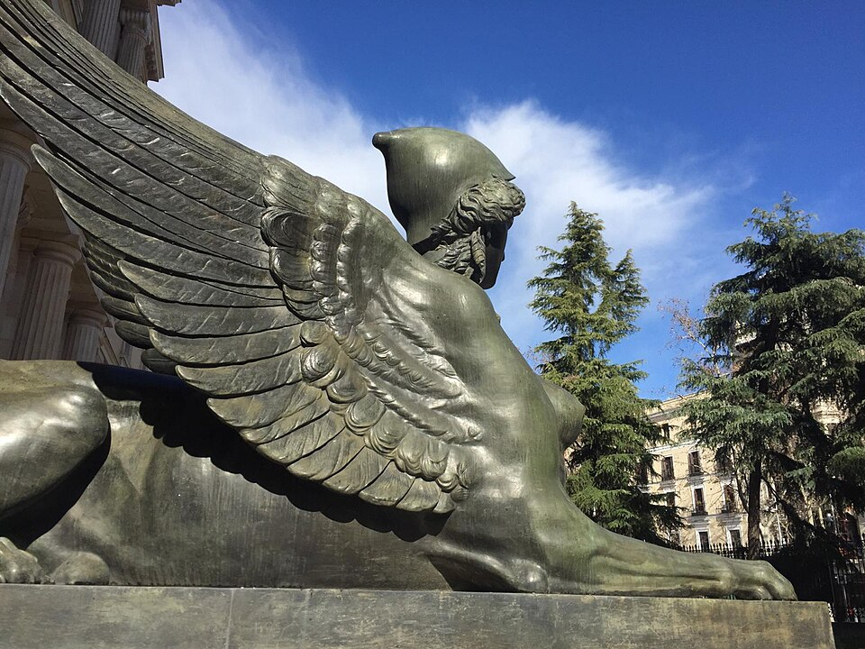

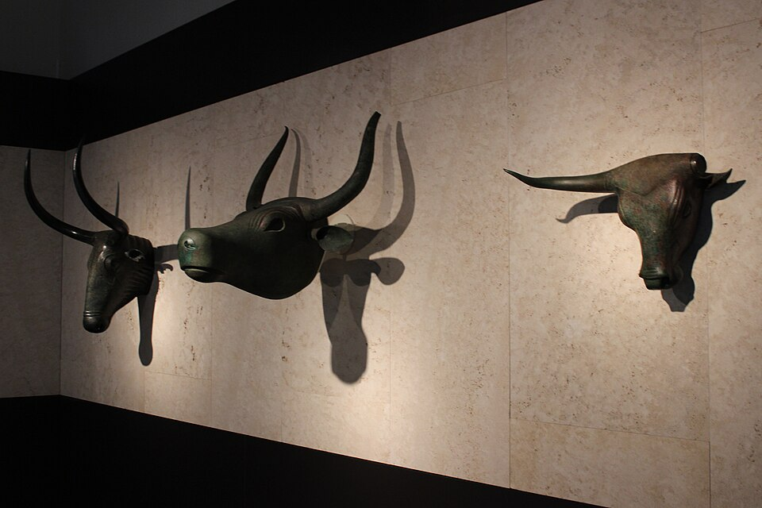

## 巴塞罗那

### 当地特色活动

#### 音乐宫导览，或挑一场音乐会

在彩色玻璃、马赛克与雕塑包围的音乐厅里，建筑本身就很值得慢看。想认真了解装饰细节选导览；更想感受声音与空间的关系，则按出行日期选一场自己喜欢的音乐会。

- 类型：建筑与音乐；按营业与预约安排
- 预留：导览建议留 1–1.5 小时；音乐会按节目单
- 日期与预约：导览和演出是不同产品；2027 年具体曲目、开放区域与语言以官网为准。
- 地点：Palau de la Música Catalana, Barcelona
- 顺路安排：与哥特区、博恩区同一天较方便。演出安排在抵达第二晚以后，留出适应时差的时间。
- [官方资料／预约](https://www.palaumusica.cat/en/discover-the-palau_1633301)

#### Las Golondrinas 港口游船 · 本次新增

从水面看巴塞罗那作为港口城市的一面，包括码头、海滨建筑与港湾作业。可选短港湾航线或较长海岸航线，订票时注意它们的航程不同。

- 类型：游船与渡轮；看船期与海况
- 预留：船程约 40 或 60 分钟，另留候船时间
- 日期与预约：当前 40 分钟航线网页列有周末班次，不能默认工作日都有；实际日期、停航与航线以运营方为准。
- 地点：哥伦布纪念碑附近的 Drassanes 码头；以船票集合点为准。
- 顺路安排：哥特区或海事博物馆方向步行后接一段船程。
- [官方资料／预约](https://lasgolondrinas.com/en/tour/barcelona-port-40-min/)

### 本次补充的文化与风景

#### 圣十字圣保罗医院现代主义建筑群

这座旧医院将医疗、城市规划与加泰罗尼亚现代主义建筑结合起来。彩色穹顶、马赛克、独立院舍与花园展示了高迪以外的另一条巴塞罗那建筑线索。

- 看点：多梅内克·蒙塔内尔的院舍设计、陶瓷与马赛克细节，医疗历史展示。
- 预留：1.5–2 小时
- 参观提示：参观的是历史建筑园区；开放院舍和导览语言按当天票种确认。
- 顺路安排：可与圣家堂放在同一天，分别预留预约时间。
- [官方介绍](https://www.spain.info/en/places-of-interest/sant-pau-modernist-site/)

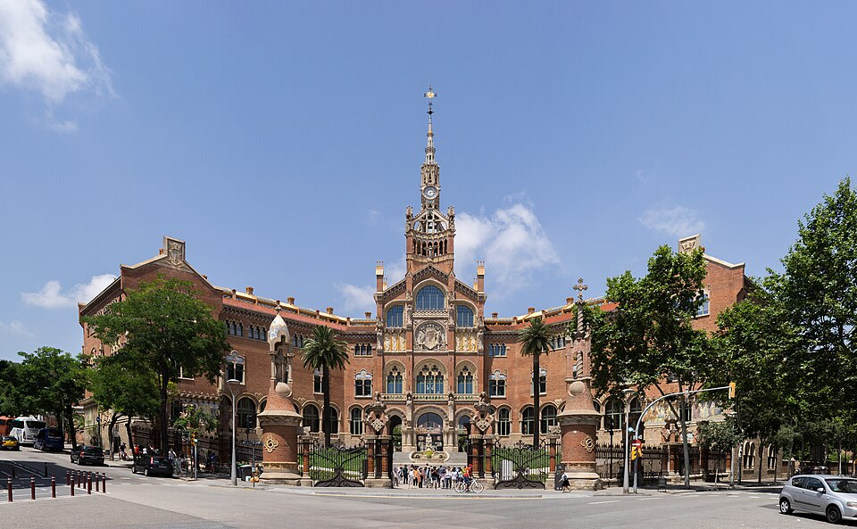

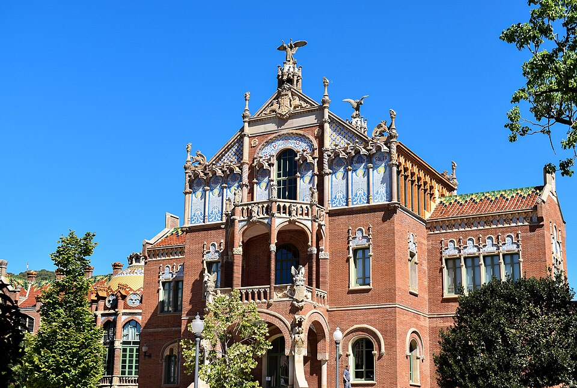

## 瓦伦西亚

### 当地特色活动

#### 阿尔布费拉乘船＋当地米饭午餐

到湖区和稻田边看看瓦伦西亚城市之外的生活，在 El Palmar 吃一餐米饭，再坐传统小船看潟湖景色。与艺术科学城的城市建筑形成很好的变化，也适合包车灵活接送。

- 类型：自然与饮食；按营业与预约安排
- 预留：建议半天 4–5 小时，含往返与用餐
- 日期与预约：当地旅游局有船游加米饭餐产品；开航受天气影响。日落游与午餐产品未必是同一场次。
- 地点：El Palmar（湖区村庄参考位置，码头以订单为准）
- 顺路安排：东海岸路线在瓦伦西亚留一个完整半天；如果只住两晚，艺术馆、海边和湖区需要取舍。
- [官方资料／预约](https://www.visitvalencia.com/en/what-to-see-valencia/albufera-natural-park)

#### 旁听瓦伦西亚水法庭 · 本次新增

这是灌溉水权传统延续至今的公共审理机构，与周边农业和城市历史紧密相关。到场的重点是理解制度与仪式，不是等待一场专为游客编排的演出。

- 类型：地方传统；固定星期
- 预留：现场约 15–30 分钟，提前到达
- 日期与预约：通常周四中午 12 点在大教堂使徒门举行；节假日、特殊安排和实际审理内容需核对。不是每天都有。
- 地点：Plaza de la Virgen，大教堂 Puerta de los Apóstoles。
- 顺路安排：与圣母广场、大教堂及老城步行安排在同一上午。
- [官方资料／预约](https://www.visitvalencia.com/en/what-to-do-valencia/valencian-culture/monuments-in-valencia/water-court)

### 本次补充的文化与风景

#### 阿尔布费拉自然公园（城外）

潟湖、稻田、沙丘和海岸林带构成瓦伦西亚南面的自然景观，也与当地稻作和饮食紧密相连。既可在岸边步行看景，也可另订传统小船。

- 看点：潟湖水面、湿地鸟类、稻作景观与傍晚光线。
- 预留：半天，乘船另按所订航次安排
- 参观提示：位于城外；稻田景色和鸟类随季节变化，不能把夏季绿稻田当作四月实景。保护区部分参观需预约。
- 顺路安排：与 El Palmar 乘船及米饭午餐组成半天。
- [官方介绍](https://www.visitvalencia.com/en/what-to-see-valencia/albufera-natural-park)

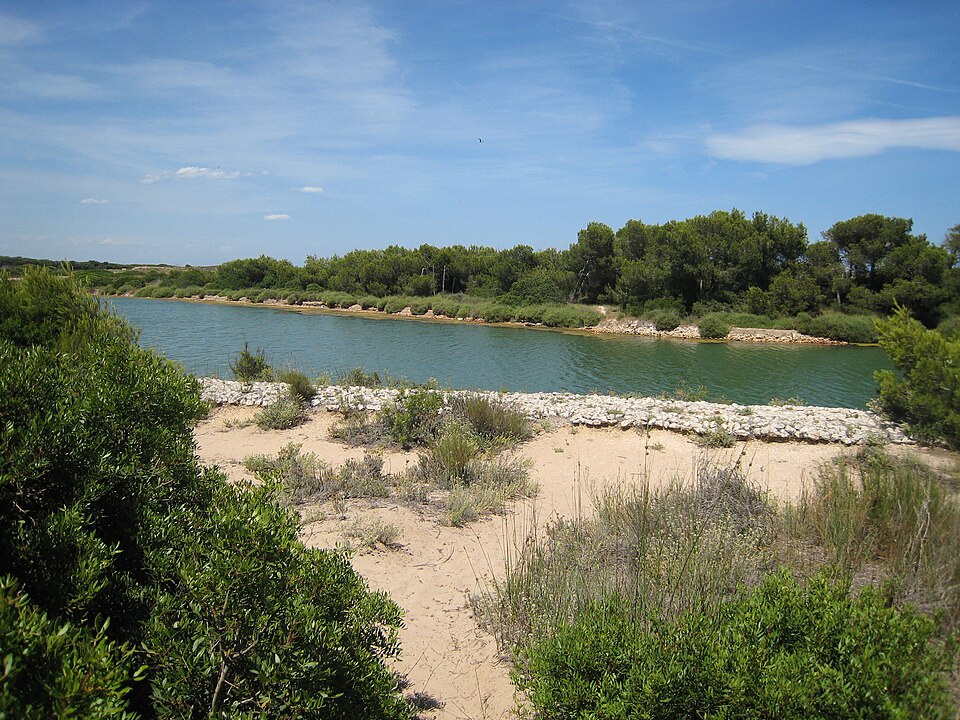

#### IVAM 瓦伦西亚现代艺术学院

瓦伦西亚的重要现代与当代艺术机构，可从雕塑、绘画、摄影和专题展览观察二十世纪以来的艺术变化。适合在历史老城之外补充现代艺术视角。

- 看点：以当期展览为主线；留意胡里奥·冈萨雷斯等馆藏关联的艺术主题。
- 预留：1.5–2 小时
- 参观提示：馆藏目录不等于当天陈列；确认展厅开放与临时展览。
- 顺路安排：与卡门区街巷散步组合。
- [官方介绍](https://www.spain.info/es/lugares-interes/instituto-valenciano-arte-moderno-ivam/)

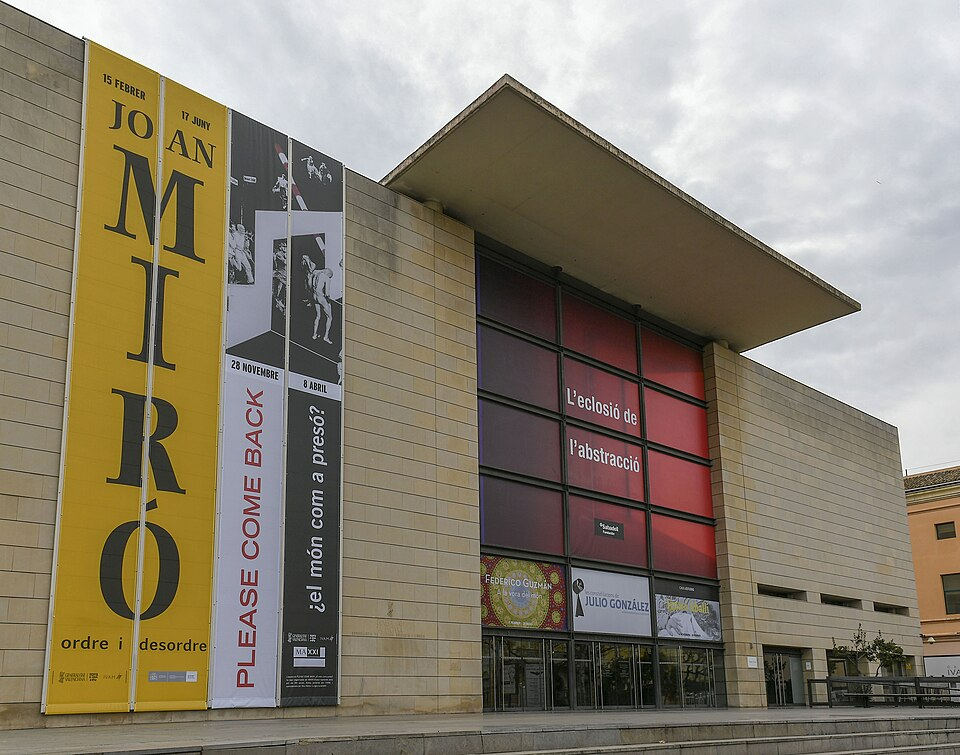

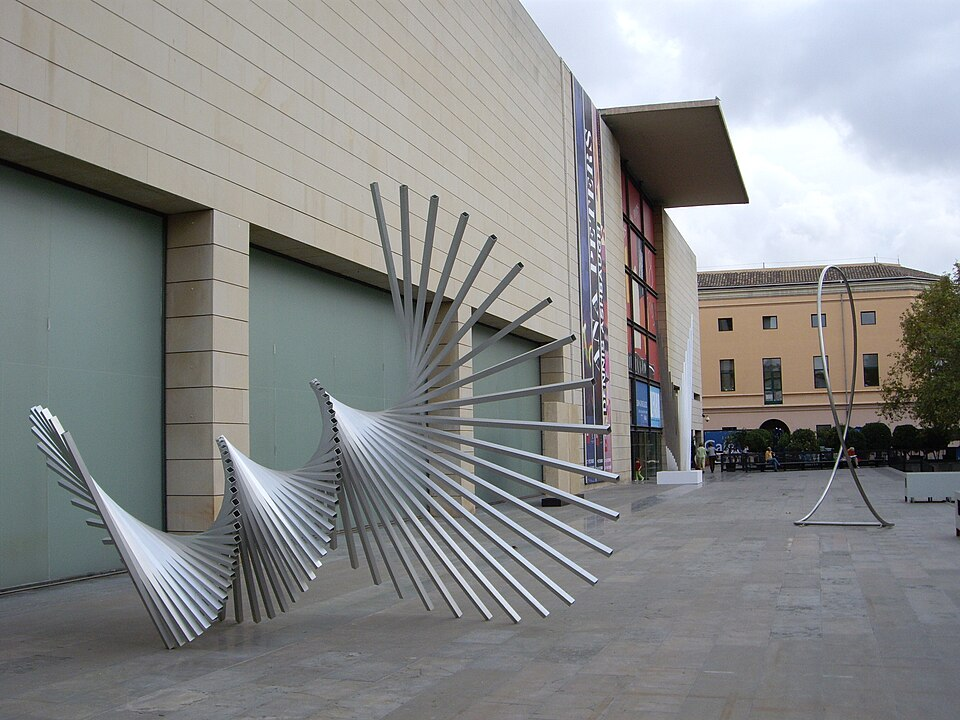

## 塞维利亚

### 当地特色活动

#### 先看舞蹈博物馆，再看现场

白天先了解弗拉明戈的表达与舞蹈背景，晚上再看现场表演，适合第一次接触、希望看得更懂的人。官网有博物馆加演出的组合选择，参观和演出的入场安排需分别留意。

- 类型：现场演出；按营业与预约安排
- 预留：组合建议留 2–2.5 小时，按实际场次调整
- 日期与预约：官网按日期售票；博物馆参观与演出时段不是同一件事。
- 地点：Calle Manuel Rojas Marcos 3, Sevilla
- 顺路安排：如果格拉纳达已经订洞穴演出，这里可只看博物馆，把另一个晚上留给宅邸、河边和晚餐。
- [官方资料／预约](https://tickets.museodelbaileflamenco.com/eng/completa-reserva-step1.php?actividadPK=14)

#### 特里亚纳陶瓷老厂与街区散步

从旧陶瓷工厂的空间与生产遗存，理解塞维利亚建筑上色彩鲜明的瓷砖从哪里来，再到周边街道看陶瓷店和街区生活。这里的地方性来自传统工艺与真实生产空间。

- 类型：传统工艺；按营业与预约安排
- 预留：建议 2–3 小时，含陶瓷中心与街区
- 日期与预约：中心是参观项目；若另选手作课程，要向具体工作室预约，不能默认入馆票含体验。
- 地点：Centro Cerámica Triana, Sevilla
- 顺路安排：塞维利亚多住一晚时，安排半天特里亚纳，傍晚沿河吃饭；不要与王宫、大教堂挤成同一上午。
- [官方资料／预约](https://visitasevilla.es/en/centro-ceramica-triana/)

#### 瓜达尔基维尔河城市游船 · 本次新增

从河上看桥梁、两岸街区与塞维利亚的航运历史景观。它是一段城市水上游览，可以与特里亚纳岸边步行对照着看。

- 类型：游船与渡轮；看船期与水况
- 预留：船程约 1 小时，另留候船时间
- 日期与预约：船票所含航线、语言和班次按当天确认；晚霞、餐饮或私人包船不等于普通观光票。
- 地点：黄金塔旁码头；按运营方票面确认。
- 顺路安排：黄金塔附近登船，可接特里亚纳或王宫周边的半天。
- [官方资料／预约](https://crucerosensevilla.com/entradas/paseo-en-barco-por-sevilla/)

### 本次补充的文化与风景

#### 伊塔利卡罗马遗址（城外）

在塞维利亚近郊 Santiponce，可以从罗马圆形竞技场、街道和住宅遗迹理解古代城市生活。它补充了塞维利亚王宫与大教堂之外的罗马历史层次。

- 看点：圆形竞技场、住宅马赛克与古代街道布局。
- 预留：2–3 小时，另加往返交通
- 参观提示：遗址无遮阴的路段较多；具体可入内区域和马赛克展示以保护安排为准。
- 顺路安排：从塞维利亚单独安排半天，不按老城步行景点计算。
- [官方介绍](https://www.spain.info/en/places-of-interest/archaeological-site-of-italica/)

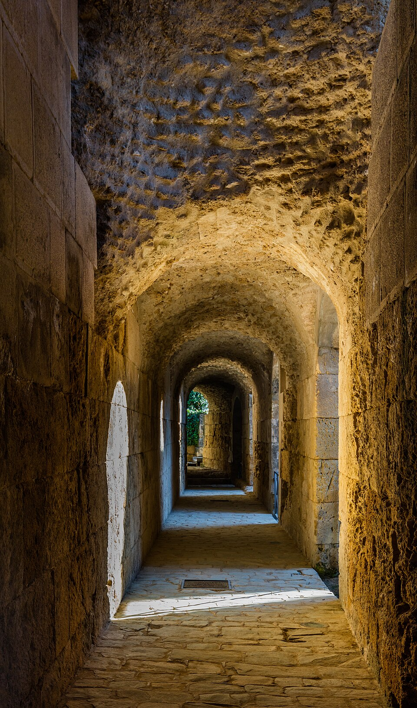

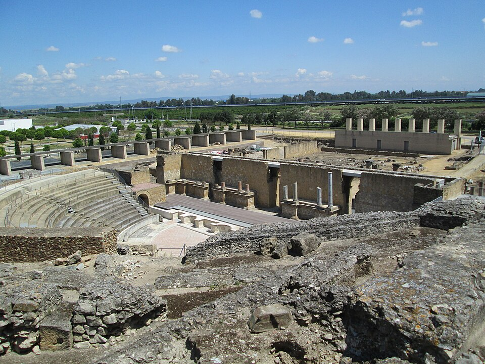

## 格拉纳达

### 当地特色活动

#### 萨克罗蒙特洞穴弗拉明戈

萨克罗蒙特的洞穴 Zambra 将弗拉明戈与当地吉卜赛文化、山坡洞穴空间联系起来。低矮白墙、铜器与老照片让环境很有地方性，歌者、吉他和舞者通常离观众较近；可留意舞步、掌声节奏、歌唱与彼此回应。

- 类型：现场演出；按营业与预约安排
- 预留：演出约 1 小时；另留上山、入场与返程时间
- 日期与预约：官网当前通常 19:45 开演，建议提前 20 分钟到；2027 年场次待核对。
- 地点：Camino del Sacromonte 89, Granada
- 顺路安排：适合阿尔拜辛、圣尼古拉斯观景台那天下午之后；洞穴场与 Zoraya 二选一即可。晚间接送先和包车司机约好上落客点。
- [官方资料／预约](https://www.marialacanastera.com/en/)

#### 花园宅邸里的弗拉明戈之夜

场所在阿尔拜辛传统 carmen 宅邸内，带花园与餐厅。想把散步、晚餐和一场演出连起来，可以选择这里；演出场地和花园用餐区域以所订产品安排为准。

- 类型：现场演出；按营业与预约安排
- 预留：演出约 60 分钟；含用餐建议留 2–3 小时
- 日期与预约：官网当前列 18:00、20:00、22:30；这是现行参考，非已确认的 2027 演出表。
- 地点：Calle Panaderos 32, Granada
- 顺路安排：与阿尔拜辛同一天最顺路。只看一场时，在洞穴氛围与宅邸用餐便利之间选；餐食是否包含须看票种。
- [官方资料／预约](https://flamencogranada.com/en/)

#### 自己试一节弗拉明戈入门课

比连续看两场表演更有参与感：通过入门课接触基本节奏与动作，再看舞台上的表现。适合愿意活动身体、对舞蹈好奇的人；课程语言和是否适合零基础可在预约时确认。

- 类型：动手体验；按营业与预约安排
- 预留：课程约 1 小时
- 日期与预约：官网当前介绍每日 15:30 的入门课；实际日期和课程安排以预约页为准。
- 地点：Calle Panaderos 32, Granada
- 顺路安排：建议放在格拉纳达加住的第三天；两晚版若阿宫已排满，就只保留晚间演出。
- [官方资料／预约](https://flamencogranada.com/en/)

#### 阿拉伯浴场休整

在不同水温的浴池间放慢节奏，选择单纯水疗或含按摩的项目，适合连续古城步行之后休整。这里是现代经营的浴场体验；历史浴场遗址 El Bañuelo 则是参观古建，两者要分开安排。

- 类型：放松体验；按营业与预约安排
- 预留：建议留 1.5–2 小时，具体按所订套餐
- 日期与预约：按官网日期与时段预约；按摩、搓浴并非所有票种都含。
- 地点：Calle Santa Ana 16, Granada
- 顺路安排：阿尔罕布拉游览后的傍晚可以选这一项；与晚间演出之间留出换衣、吃饭和交通时间。
- [官方资料／预约](https://granada.hammamalandalus.com/en/hammam-experiences/)

#### 老城 Tapas 小吃散步

在两三家小店少量点单，比赶一顿正式大餐更容易接触本地日常。格拉纳达有点饮品附带小吃的传统，具体是否附送、能否自选和份量仍看各店规则；也可以直接点喜欢的小盘菜。

- 类型：当地饮食；按营业与预约安排
- 预留：建议 1.5–2 小时
- 日期与预约：自由安排；不把每家店都默认成“免费小吃”。
- 地点：地图参考：Calle Navas 一带（街区，非指定餐厅）
- 顺路安排：可作抵达日轻松晚餐。看演出当天先吃一点，回程不必再赶第二个预约。
- [官方资料／预约](https://turismo.granada.org/en/what-do/tapas-granada)

### 本次补充的文化与风景

#### 格拉纳达卡尔图哈修道院

修道院内部展现格拉纳达巴洛克艺术：大理石、木雕和精密装饰形成浓密的视觉层次。与阿尔罕布拉的伊斯兰宫廷艺术并看，能直观感受两种不同的艺术语言。

- 看点：圣器室、圣体礼拜空间及教堂内部的雕刻装饰。
- 预留：1–1.5 小时
- 参观提示：以宗教建筑参观规则为准，入场、拍摄与开放空间可能调整。
- 顺路安排：在老城北侧，可单独占一个短半天。
- [官方介绍](https://www.spain.info/es/lugares-interes/monasterio-cartuja/)

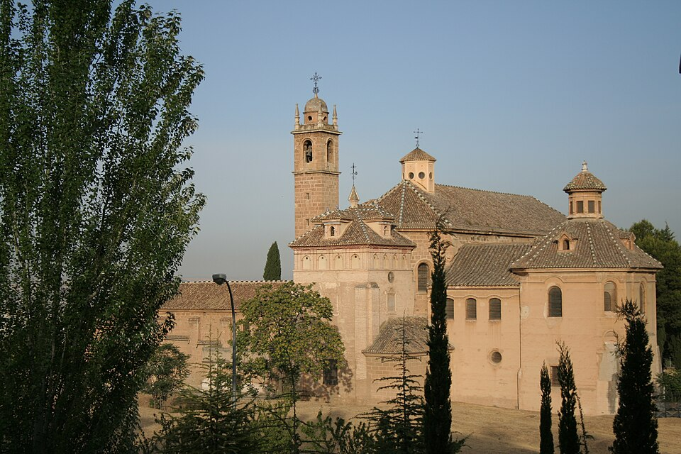

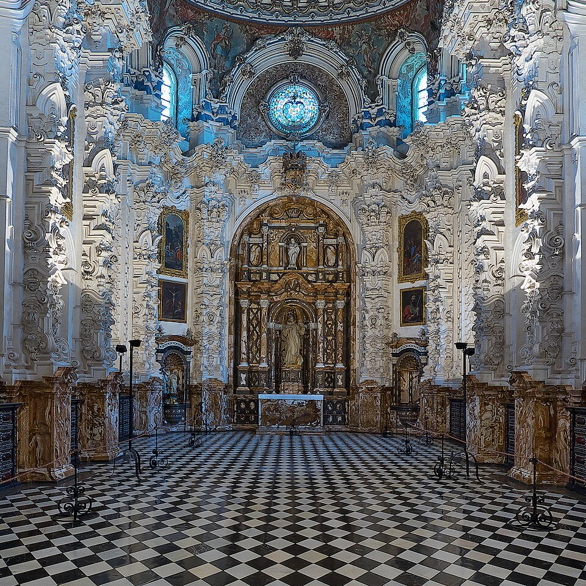

## 科尔多瓦

### 当地特色活动

#### 皇家马厩的安达卢西亚马术表演

在皇家马厩观看以安达卢西亚马为主角的骑术展示，把白天的历史建筑参观接到晚上的地方表演。适合想在弗拉明戈之外再选一种安达卢西亚体验的人。

- 类型：现场演出；按营业与预约安排
- 预留：建议留 1.5–2 小时含到场；演出时长以票面为准
- 日期与预约：以 Córdoba Ecuestre 当日节目和售票为准，未确认 2027 清明场次。
- 地点：Calle Caballerizas Reales 1, Córdoba
- 顺路安排：很适合科尔多瓦住一晚的方案；先确认有合适场次，再决定把维亚纳宫留到翌日上午。
- [官方资料／预约](https://www.turismodecordoba.org/the-passion-and-spirit-of-andalusian-horse)

#### 圣巴西利奥庭院街区探访 · 本次新增

以日常居住庭院和街巷理解科尔多瓦的院落文化：植物、用水、遮阴与邻里生活共同构成空间。可选择当期开放庭院路线，不必只把庭院等同于一座宫殿。

- 类型：地方传统；常设路线与五月节庆分开
- 预留：1.5–2 小时
- 日期与预约：著名庭院节主要在五月；四月只能按全年开放或预约路线参观，花量与可进庭院不同。Trueque Cuatro 的临时关闭信息需复核，暂不作为必去点。
- 地点：San Basilio 街区；参观集合点随所选开放路线。
- 顺路安排：可在清真寺大教堂之后单独留一段慢行时间。
- [官方资料／预约](https://www.turismodecordoba.org/visitar-patios-de-cordoba-1)

### 本次补充的文化与风景

#### 麦地那·阿萨哈拉宫城遗址（城外）

科尔多瓦哈里发时代的宫城遗址沿山坡展开，展示宫廷、行政与城市规划的尺度。先看解释中心，再看现场残存的柱廊、平台和建筑，通常比只到遗址拍照更容易理解。

- 看点：山坡台地布局、石雕装饰、博物馆与遗址之间的对应关系。
- 预留：半天
- 参观提示：城外遗址与游客中心之间的接驳按当期安排；部分厅堂可能受修复限制。不要套用旧年份的特别开放活动。
- 顺路安排：作为科尔多瓦加住一晚时的一项城外内容。
- [官方介绍](https://www.spain.info/es/lugares-interes/medina-azahara/)

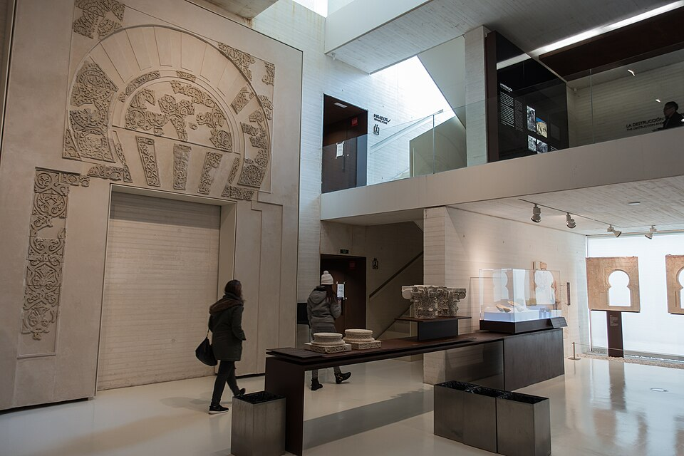

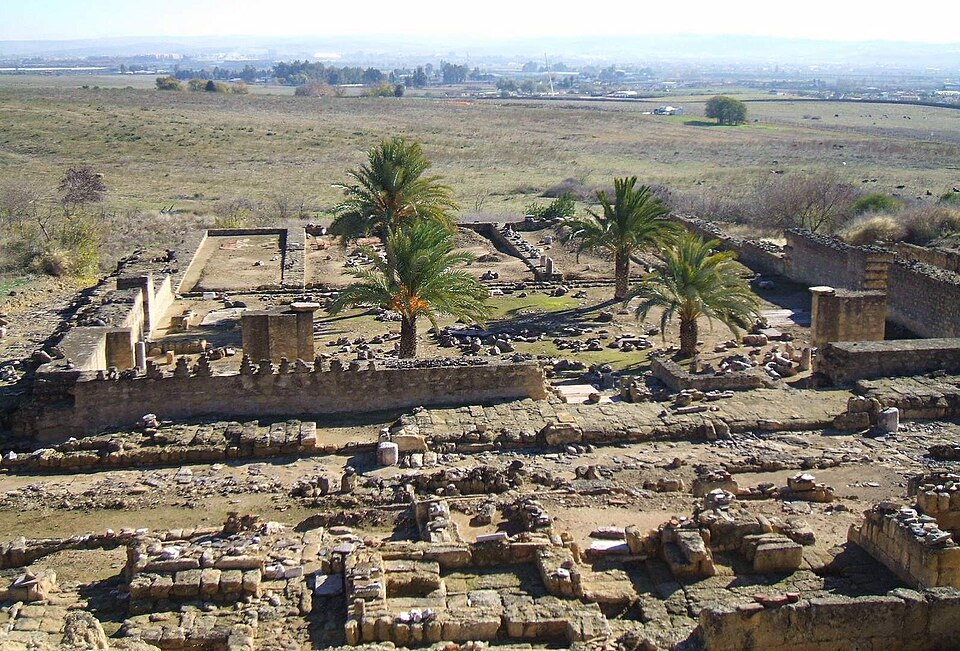

## 马拉加

### 当地特色活动

#### 海边吃 Espeto 烤沙丁鱼

在海边餐馆尝试用芦苇签串起、靠炭火烤制的沙丁鱼，配上慢慢散步的午后。它更像一段当地生活体验，不需要把休整日再塞满收费景点。

- 类型：当地饮食；按营业与预约安排
- 预留：建议 2–3 小时，含午餐和海边散步
- 日期与预约：餐馆、当日鱼货与天气影响体验；4 月是否供应、营业和预约出发前再确认。
- 地点：Playa de El Palo（街区参考，非指定餐厅）
- 顺路安排：内陆路线马拉加第二天上午看一座美术馆，午后到海边；海滨街区停车与上下客请司机现场确认。
- [官方资料／预约](https://www.malagaturismo.es/en/post/sardine-skewer)

#### 国王小道峡谷步道（城外） · 本次新增

沿峡谷岩壁上的栈道看河谷与工业工程遗存，是马拉加腹地的代表性户外体验。它与市中心散步不同，需要按入口、单向线路和接驳安排完整半天以上。

- 类型：户外与自然；预约且看天气
- 预留：约 5–7 小时，含马拉加往返与接驳
- 日期与预约：提前订时段；目前不接待 8 岁以下儿童。北入口步行接近、游览与终点接驳需一起核对，恶劣天气可能关闭。
- 地点：Ardales／El Chorro 一带，远离马拉加市中心。
- 顺路安排：建议马拉加多住一天时安排，不放进当天已含长途转场的行程。
- [官方资料／预约](https://www.caminitodelrey.info/es/tu-visita/preguntas-frecuentes)

### 本次补充的文化与风景

#### 拉孔塞普西翁历史植物园

马拉加北侧的历史植物园以亚热带植被、林荫路径和景观园林见长。适合把海岸城市的行程延伸到植物与花园，而非只在沙滩和市中心活动。

- 看点：亚热带植物、历史园路与不同高度的景观视角。
- 预留：2–3 小时
- 参观提示：花期受天气影响，不能保证四月某一种花正盛开；园路有坡度，先查看导览图。
- 顺路安排：从老城单独留半天，交通与游园分开计时。
- [官方介绍](https://laconcepcion.malaga.eu/es/)

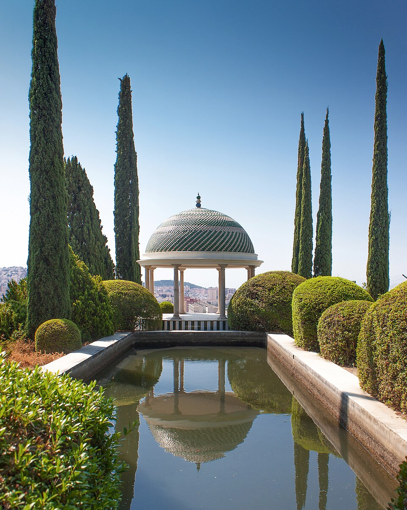

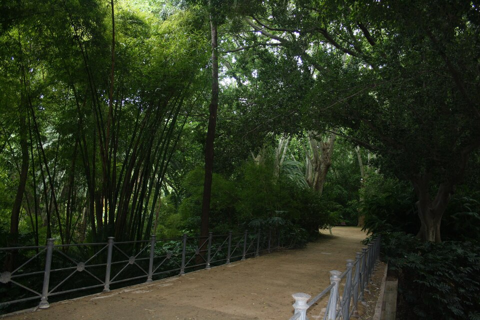

#### 马拉加蓬皮杜中心

港口彩色立方体下的艺术空间，提供现代与当代艺术展览。与毕加索、提森等馆相比，可把注意力放在不同媒介、当代主题与展览策划。

- 看点：按当期展览选择绘画、影像、装置或雕塑；彩色立方体与港口步道。
- 预留：1.5–2 小时
- 参观提示：馆藏借展与临时展会更新，以官网展期为准；建筑外观不需要等同于购买展览门票。
- 顺路安排：与 Muelle Uno 港口散步组成半天。
- [官方介绍](https://centrepompidou-malaga.eu/)

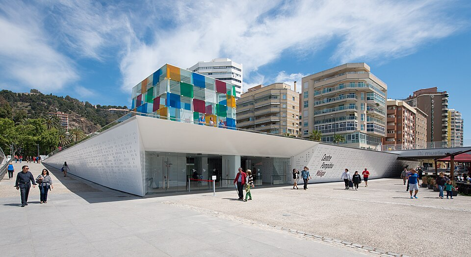

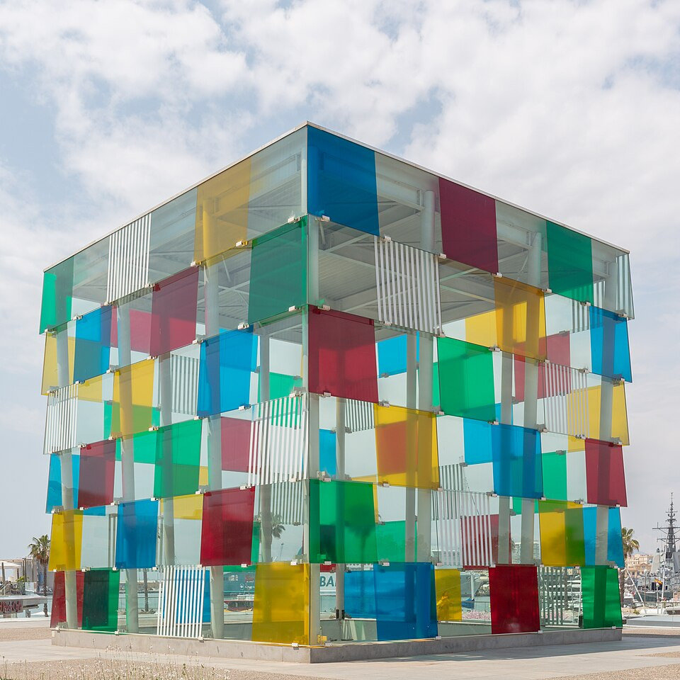

## 龙达

### 当地特色活动

#### 龙达乡间酒庄参观与品鉴

酒庄提供葡萄种植、酿造与陈酿区域参观，配合品酒，更适合愿意为乡间生活多留一点时间的人。包车可以接送，但庄园往返、参观和午餐要作为额外行程计算。

- 类型：当地饮食；按营业与预约安排
- 预留：建议留 2–3 小时另加接送；具体套餐时长询问酒庄
- 日期与预约：官网要求联系确认预约和价格；2027 清明可用日期未核实。
- 地点：Bodega García Hidalgo, Ronda（以预约接待入口为准）
- 顺路安排：原东海岸路线是格拉纳达经龙达到塞维利亚的长日子，若加酒庄，建议龙达住一晚或删减其他停留。
- [官方资料／预约](https://bodegasgarciahidalgo.es/en/alojamiento-casa-rural/)

#### 塔霍峡谷步道看新桥 · 本次新增

从峡谷内部或开放步道的较低视角观察龙达新桥、岩壁与城市边缘，和桥面拍照形成不同体验。

- 类型：户外与自然；开放路段需核对
- 预留：约 1–1.5 小时，按开放路段调整
- 日期与预约：该项目存在分阶段建设，不能把规划中的完整线路当作已经开放。按官网当期路线、时段与天气安排订票。
- 地点：老城峡谷步道入口；以预约说明为准。
- 顺路安排：适合在龙达过夜时安排；短暂中途停靠只选桥面和老城也可。
- [官方资料／预约](https://desfiladerodeltajo.info/)

### 本次补充的文化与风景

#### 阿西尼波罗马遗址（龙达远郊）

在龙达周边高地上，罗马剧场残迹与开阔乡村景观同时可见。这里提供古代聚落与安达卢西亚田野的组合，节奏与龙达新桥周边的密集老城不同。

- 看点：罗马剧场遗迹、看台与高地远景。
- 预留：1–1.5 小时，另留往返交通
- 参观提示：远离龙达市中心，出发前确认当天开放；阴雨或大风会影响露天游览。
- 顺路安排：适合龙达过夜后的半天，不宜塞进短暂中途停靠。
- [官方介绍](https://www.spain.info/es/lugares-interes/ruinas-teatro-romano-acinipo-ronda-vieja/)

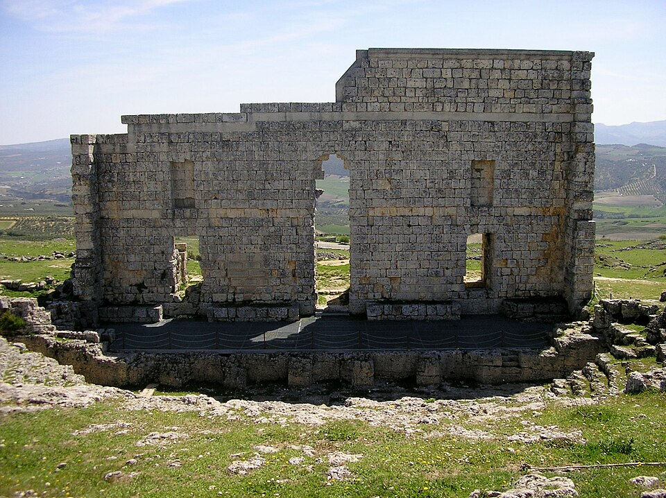

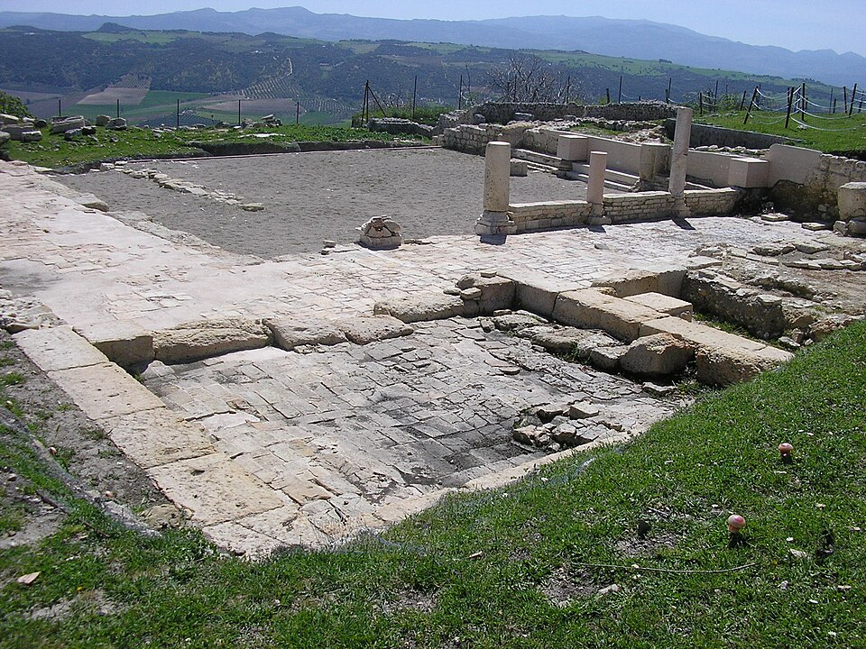

## 托莱多

### 当地特色活动

#### 托莱多金银镶嵌／制剑工艺体验

托莱多的 damasquinado 把金银嵌入金属，细节与耐心比纪念品柜台更值得看。市旅游局列有参与式金银镶嵌和制剑工作坊，可以先询问适合你们人数、语言和时间的课程。

- 类型：动手体验；按营业与预约安排
- 预留：建议预留 1–2 小时，按工作坊确认
- 日期与预约：须预约。具体工坊、集合地址、语言与可体验内容由组织方确认；地图仅定位托莱多老城。
- 地点：预约后确认集合点；地图仅为城市参考位置
- 顺路安排：内陆线托莱多住一晚时更从容；东海岸可选途中停留版不宜同时安排完整工坊和大教堂深游。
- [官方资料／预约](https://turismo.toledo.es/recursos/id32765-go-craft.html)

#### Puy du Fou 西班牙历史夜间大秀 · 本次新增

用舞台、灯光、群演与大型场景讲述西班牙历史题材。属于艺术化历史娱乐，与托莱多真实古迹参观互为补充，不能当成逐项准确的历史纪录片。

- 类型：现场演出；演出按日期
- 预留：晚间约 1–1.5 小时；园区日场另计
- 日期与预约：日间园区与夜秀可能是不同票种；2027 演出日历、入场和散场时间需再查。城市导览票不包含此演出。
- 地点：托莱多西南郊，不能按老城步行抵达计算。
- 顺路安排：更适合托莱多过夜；若演后返回马德里，要预留夜间包车接送。
- [官方资料／预约](https://turismo.toledo.es/recursos/ocio/id32793-puy-du-fou--espana.html)

### 本次补充的文化与风景

#### 圣玛利亚白色会堂

这处历史会堂以白色柱列、马蹄拱与细密装饰形成安静的空间。它让托莱多的犹太历史与穆德哈尔艺术更具体，不只是把“三种文化”当作一句城市标签。

- 看点：白色柱厅、拱券与柱头；建筑在不同时期的用途。
- 预留：30–60 分钟
- 参观提示：结合官方介绍理解宗教用途的变迁；通票包含项目和开放时间需再次核对。
- 顺路安排：与犹太区、格列柯博物馆顺路。
- [官方介绍](https://www.turismocastillalamancha.es/es/cultura-y-patrimonio/monumentos/toledo/sinagoga-de-santa-maria-la-blanca)

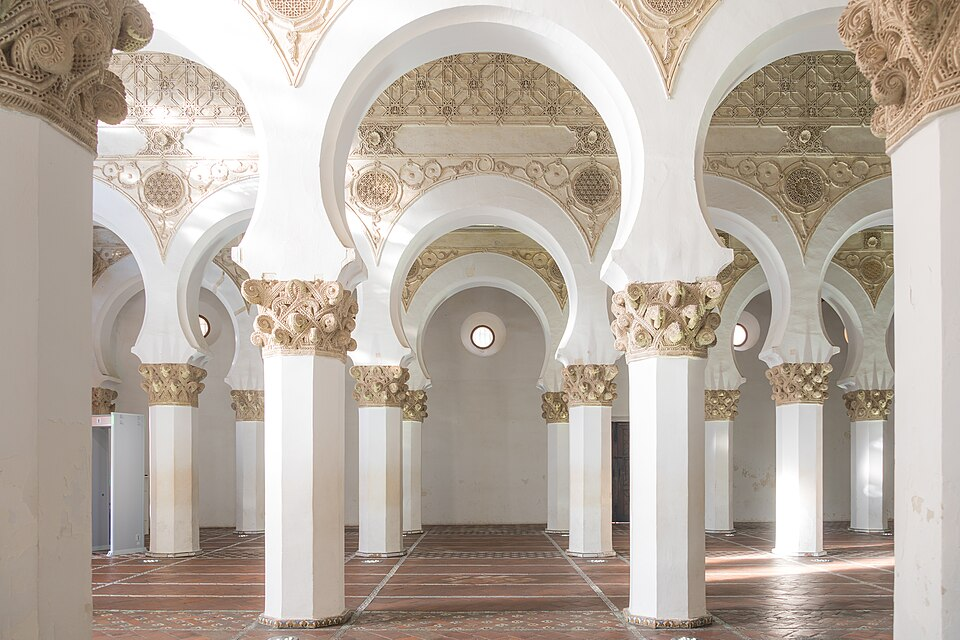

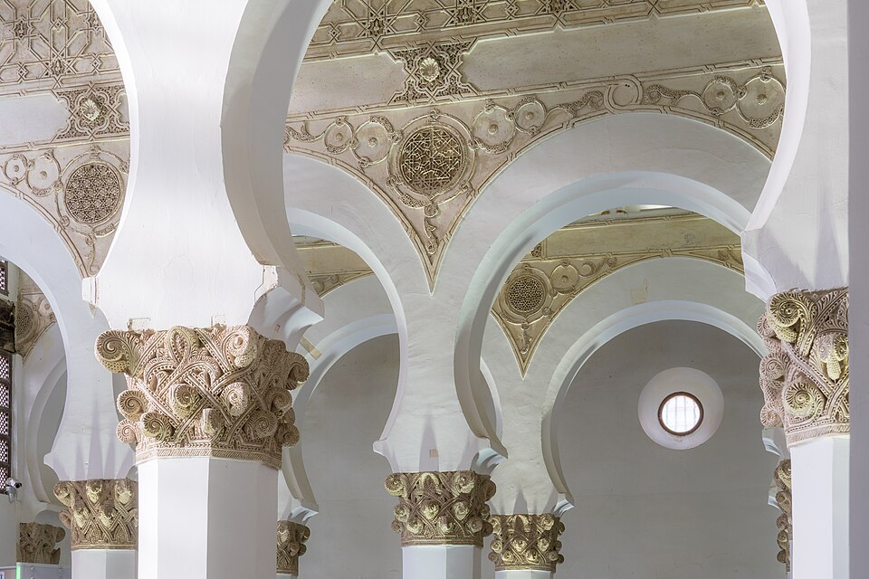

## 塞哥维亚

### 当地特色活动

#### 日出热气球俯瞰古城 · 本次新增

塞哥维亚的高空视角能把渡槽、老城和周边高原放在一幅画面中。飞行轨迹由风决定，不能保证从某座地标正上方经过。

- 类型：户外与自然；看天气、清晨集合
- 预留：全程约 3–4 小时；飞行时长看产品
- 日期与预约：选择旅游局所列运营商，核对集合点、年龄及身体条件要求、取消政策。七月热气球节是另一活动，四月并不等于参加节庆。
- 地点：起飞场地会随风向调整，地图只定位塞哥维亚参考点。
- 顺路安排：通常需要前一晚住当地或很早从马德里出发。
- [官方资料／预约](https://www.turismodesegovia.com/es/turismo-deportivo-y-activo/vuela-en-globo)

#### 尝一餐塞哥维亚烤乳猪 · 本次新增

烤乳猪是当地餐桌的代表菜，可以通过传统餐馆的一餐了解卡斯蒂利亚饮食。这里列的是自主用餐，不把餐馆的切盘演示当作每桌保证提供的节目。

- 类型：当地饮食；自主体验
- 预留：约 1–1.5 小时
- 日期与预约：按实际餐馆预订、确认份量及营业日；不需要另买所谓城市体验票。
- 地点：地点取决于所选餐馆；地图搜索为餐馆选择参考。
- 顺路安排：渡槽或主广场一带游览后安排午餐。
- [官方资料／预约](https://www.turismodesegovia.com/es/gastronomia/la-despensa)

### 本次补充的文化与风景

#### 拉格兰哈皇家花园（城外）

塞哥维亚附近的法式皇家花园以林荫轴线、神话雕塑与大型喷泉组成景观。可把旅行重点放在园林设计与山地背景，宫殿内部另作可选。

- 看点：雕塑喷泉、花园轴线和山林环境。
- 预留：2–3 小时，另加往返交通
- 参观提示：花园开放与喷泉喷水是两回事；喷水有特定日历，并受供水和维护影响，四月不能默认看到全部喷泉运行。
- 顺路安排：塞哥维亚多半天时安排，宫殿票与花园活动分别核对。
- [官方介绍](https://www.spain.info/es/lugares-interes/jardines-granja-san-ildefonso/)

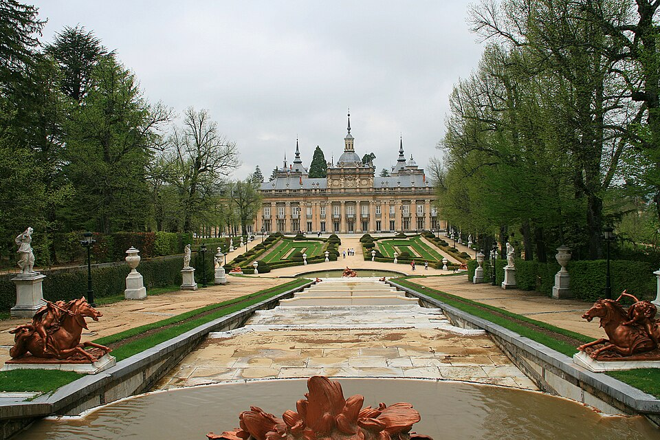

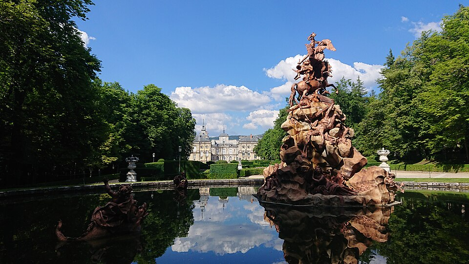

## 萨拉曼卡

### 当地特色活动

#### Ieronimus 大教堂塔楼与高处通道 · 本次新增

从高处通道、塔楼和建筑内部结构观察新旧大教堂，并俯瞰萨拉曼卡的砂岩城市。与在地面看立面相比，更能理解两座教堂相接的关系。

- 类型：建筑与导览；日场／特别夜场分开
- 预留：约 1–1.5 小时
- 日期与预约：查当期时段和台阶通行说明；夜间导览是特定日期项目，不默认每天可订。
- 地点：大教堂塔楼入口，按 Ieronimus 官方指引。
- 顺路安排：白天搭配老城；订夜场则留意晚餐与结束时间。
- [官方资料／预约](https://ieronimus.es/informacion/)

#### 面包店尝 Hornazo 肉馅饼 · 本次新增

萨拉曼卡的烘焙传统之一，以面皮包裹肉类等馅料，适合从食物理解地方生活与节日习惯。可买一小份配咖啡，不必安排正式美食团。

- 类型：当地饮食；自主体验
- 预留：约 30–45 分钟
- 日期与预约：这是自主购买品尝，不是已确认的烹饪课程；馅料与售卖时间按店铺确认。
- 地点：选择老城营业中的面包店，地图搜索不代表固定集合点。
- 顺路安排：老城步行时穿插，或作为出发前的简便一餐。
- [官方资料／预约](https://salamanca.es/files/folletos/gastronomia/Gastronomiade_SALAMANCA.pdf)

### 本次补充的文化与风景

#### 卡萨利斯新艺术与装饰艺术博物馆

以十九世纪末至二十世纪初的装饰艺术为主题，展品涵盖玻璃、雕塑、首饰等，建筑本身也具有现代主义风格。这里的参观重点是工艺与设计，而非家族生活陈设。

- 看点：彩色玻璃建筑、玻璃器与小型装饰艺术的材料和造型。
- 预留：1–1.5 小时
- 参观提示：按兴趣挑选材料专题；馆内拍摄规定与当期展区以现场为准。
- 顺路安排：与大教堂周边及河岸步行组合。
- [官方介绍](https://www.spain.info/en/places-of-interest/art-nouveau-art-deco-museum/)

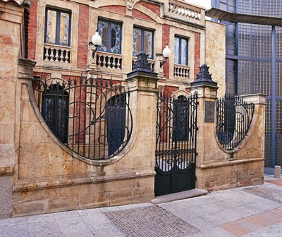

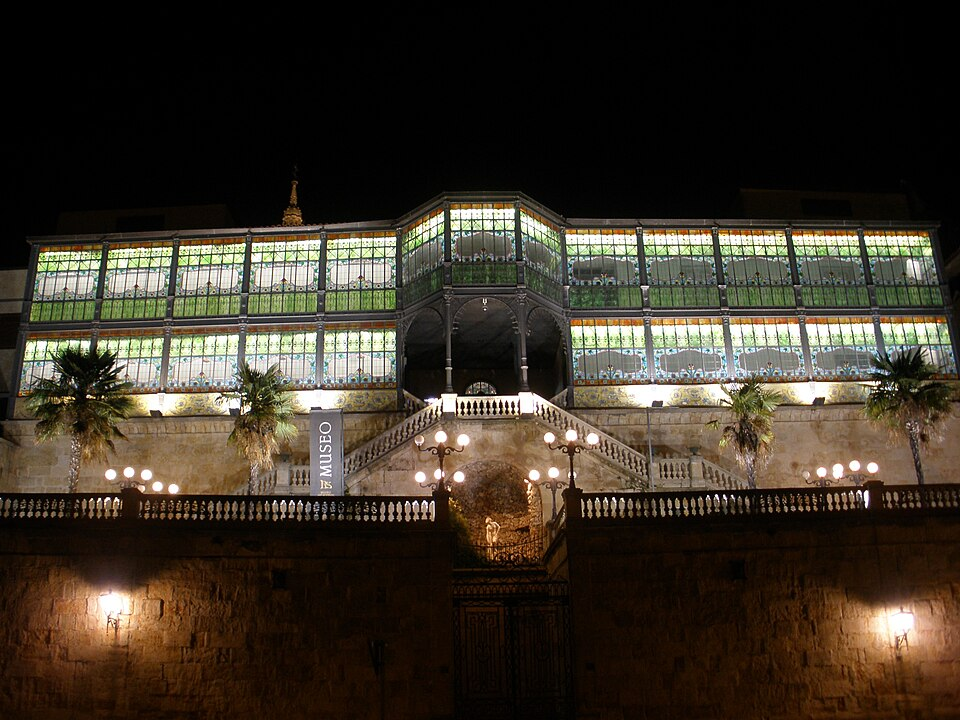

## 圣地亚哥

### 当地特色活动

#### 大教堂屋顶与 Carraca 塔导览 · 本次新增

跟随馆方人员进入大教堂屋顶与塔楼区域，从石屋顶和高处看朝圣城市的街巷结构。与免费进入教堂礼拜空间是不同体验。

- 类型：建筑与导览；须预约导览
- 预留：约 1–1.5 小时，以票面为准
- 日期与预约：官方要求这些区域跟团导览，不能独自进入；查看台阶、天气安排与所选语言。
- 地点：大教堂博物馆报到点，以购票说明为准。
- 顺路安排：与大教堂主空间参观放在同一天，留出分开的入场时间。
- [官方资料／预约](https://visitas.catedraldesantiago.es/en/cathedrals-decks-and-carracas-tower/)

#### 阿巴斯托斯市场晨间逛吃 · 本次新增

在石造市场看加利西亚海产、奶酪和农产品，把朝圣古城与当代日常生活联系起来。可自行逛市场，再按营业摊位选择品尝。

- 类型：当地饮食；自主体验
- 预留：约 1–1.5 小时
- 日期与预约：生鲜与餐饮摊位营业可能不同，先查当天营业，优先考虑上午；不默认所有摊位都能现场加工海鲜。
- 地点：Rúa das Ameas，老城东侧。
- 顺路安排：与老城东侧及民族博物馆方向组合。
- [官方资料／预约](https://www.mercadodeabastosdesantiago.com/)

### 本次补充的文化与风景

#### 加利西亚民族博物馆

博物馆设于旧修道院，介绍加利西亚的生活方式、传统行业和地方文化。它把圣地亚哥从朝圣终点扩展为一座有渔业、乡村、工艺和社会记忆的地区城市。

- 看点：地方生活与传统行业展示；历史建筑内的特色楼梯。
- 预留：1.5–2 小时
- 参观提示：留意展厅说明语言；不同主题展可能调整，先查馆方开放安排。
- 顺路安排：与 Bonaval 公园顺路，适合大教堂之外的半天。
- [官方介绍](https://www.santiagoturismo.com/museos/museo-do-pobo-galego)

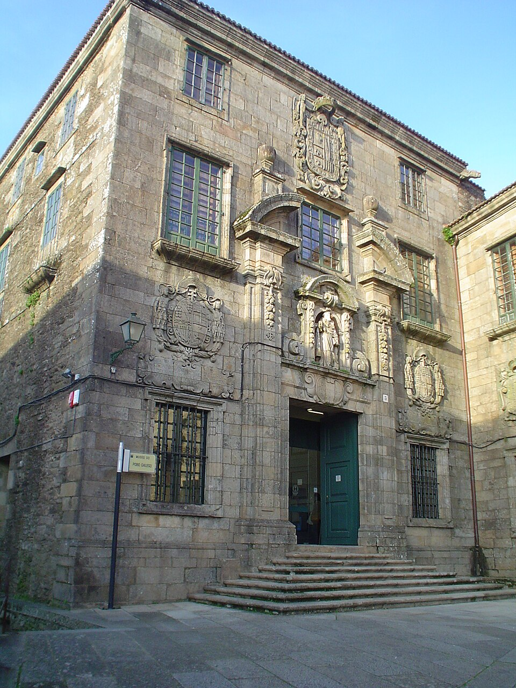

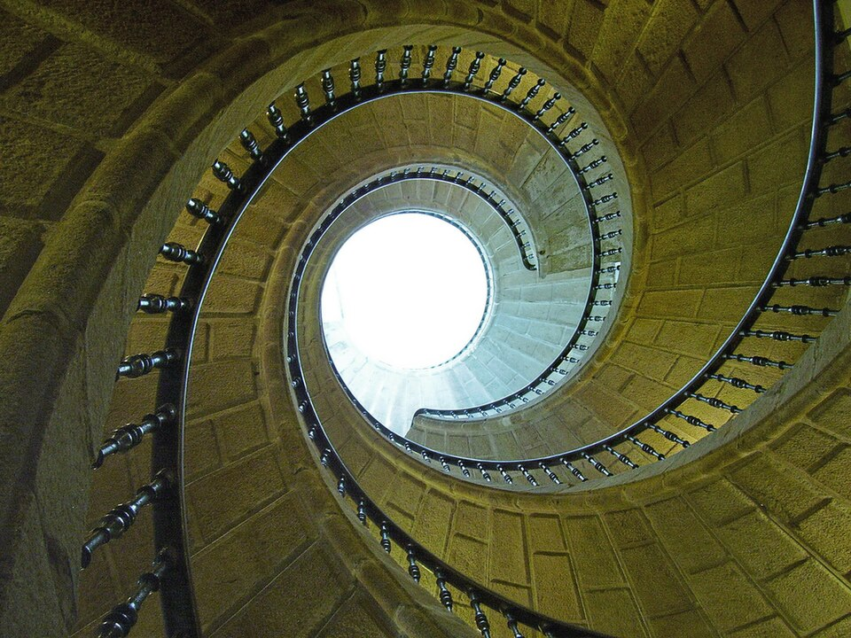

## 毕尔巴鄂

### 当地特色活动

#### 毕尔巴鄂河道游船 · 本次新增

沿内尔维翁河看城市从工业港口转向文化都市的景观，包括桥梁、两岸建筑和河岸更新。市区短线与驶向河口的长线是不同产品。

- 类型：游船与渡轮；按航次预约
- 预留：约 1–2 小时，按航线
- 日期与预约：先选择 Bilbao 市区或河口方向航线，再核对实际航程、语言和班次；不把所有地标都视为短线必经。
- 地点：Pío Baroja 附近码头；以船票为准。
- 顺路安排：与古根海姆外观和河岸步道分段安排。
- [官方资料／预约](https://bilboats.com/en/inicio/)

#### 老城 Pintxos 小吃巡游 · 本次新增

选两三家酒吧，每家少量尝试，观察吧台冷盘和现做热食的区别。重点是巴斯克城市的社交与小吃习惯，不必把所有店一次吃完。

- 类型：当地饮食；自主体验
- 预留：约 1.5–2 小时
- 日期与预约：这是自行串店安排，不是某个收费团；逐家确认菜单、营业和结账方式。
- 地点：Casco Viejo／Plaza Nueva 一带，自选店铺。
- 顺路安排：七条街或新广场一带傍晚安排。
- [官方资料／预约](https://www.bilbaoturismo.net/BilbaoTurismo/es/rutas)

### 本次补充的文化与风景

#### 比斯开运输桥（河口近郊）

连接 Portugalete 与 Getxo 的运输桥仍承担过河功能，是理解毕尔巴鄂河口工业历史的独特地点。桥下的吊舱与上方结构展示了港口航运和跨河交通如何共存。

- 看点：运作中的吊舱、钢结构与河口景观；高处步道另按开放情况选择。
- 预留：1.5–2 小时，另计市中心往返
- 参观提示：不在古根海姆附近的市中心段；吊舱与高处步道的票种、运营和天气限制分别确认。
- 顺路安排：可与 Getxo 或 Portugalete 河岸散步放在同一半天。
- [官方介绍](https://www.spain.info/en/places-of-interest/puente-colgante-vizcaya/)

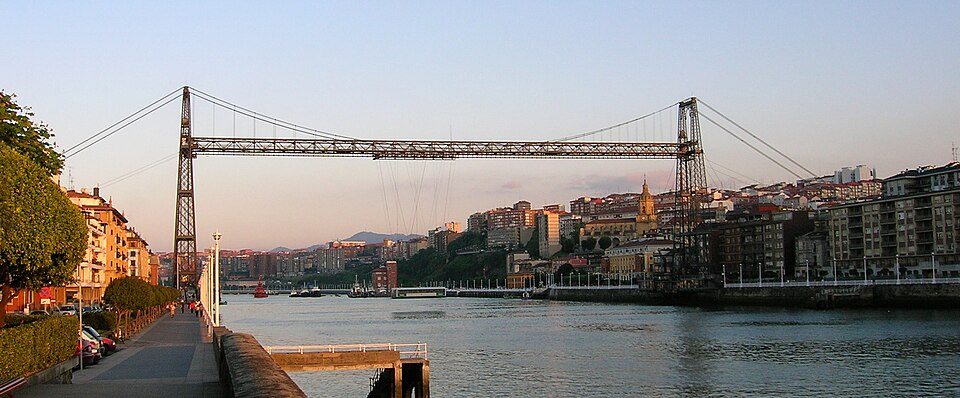

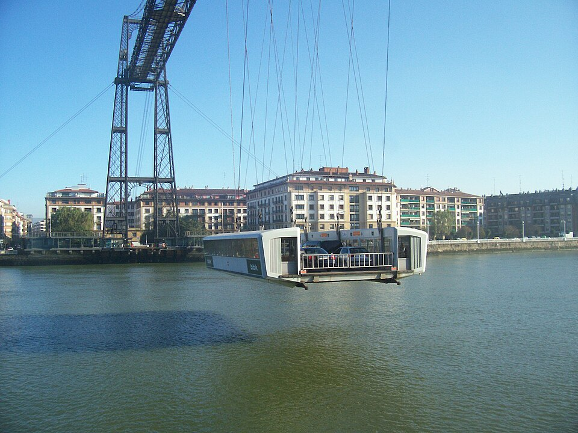

## 圣塞巴斯蒂安

### 当地特色活动

#### 苹果酒屋 Txotx 开桶与套餐 · 本次新增

在传统苹果酒屋了解从木桶取酒和配套餐食的巴斯克习惯。许多代表性酒屋位于 Astigarraga 等近郊，空间和就餐节奏与老城酒吧不同。

- 类型：地方传统；春季传统
- 预留：约 2–3 小时，另加往返
- 日期与预约：传统 Txotx 季通常约一月中旬到四月底；全年营业不等于全年都有相同开桶活动。按酒屋确认 2027 日期、套餐和预约。
- 地点：主要在 Astigarraga 等近郊，具体酒屋预订后确定。
- 顺路安排：可作为圣塞巴斯蒂安多住一晚时的一餐，包车往返近郊。
- [官方资料／预约](https://sansebastianturismoa.eus/en/gastronomy/cider/)

#### Parte Vieja 老城小吃巡游 · 本次新增

圣塞巴斯蒂安的特色在于密集酒吧之间的短距离串店，可比较传统冷小吃与现点现做的热菜。它可以是轻松的一餐，无需默认选择高价品鉴菜单。

- 类型：当地饮食；自主体验
- 预留：约 1.5–2 小时
- 日期与预约：逐店查营业和现做菜品；不是已经预订的美食导览。
- 地点：老城酒吧街区，按当日营业选择。
- 顺路安排：贝壳湾或圣特尔莫博物馆之后安排。
- [官方资料／预约](https://sansebastianturismoa.eus/en/gastronomy/going-for-pintxos/)

### 本次补充的文化与风景

#### 圣特尔莫博物馆

以巴斯克社会与文化为主线，将历史、艺术和社会变迁放进旧修道院与现代扩建空间。适合在海湾景色和饮食之外，了解当地身份、行业与日常生活。

- 看点：巴斯克历史与艺术、修道院空间、当期专题展。
- 预留：1.5–2 小时
- 参观提示：具体藏品以当日展示为准；可先选地方历史，再看艺术部分。
- 顺路安排：位于老城边缘，可与乌尔古尔山脚散步组合。
- [官方介绍](https://www.spain.info/en/places-of-interest/municipal-museum-san-telmo/)

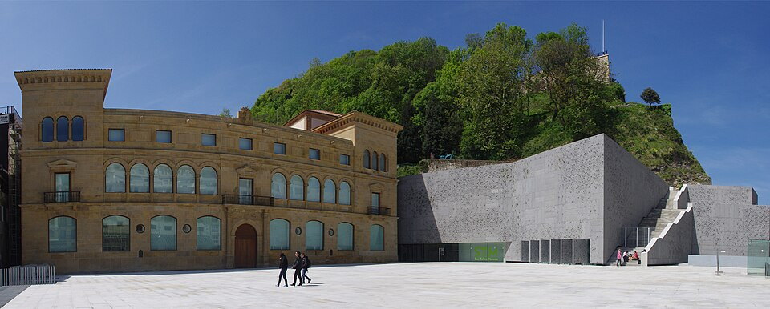

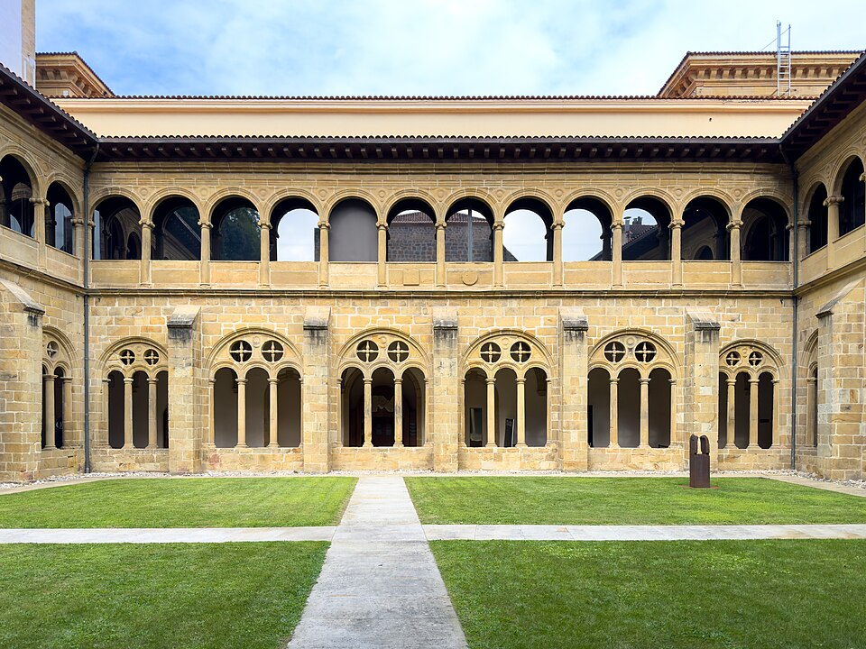

#### 风之梳海岸雕塑

奇利达的钢铁雕塑与岩石、海浪及公共空间相互作用，是圣塞巴斯蒂安最有地方性的室外艺术之一。观看不只是辨认雕塑形状，也包括海风、声响和潮汐改变的现场感。

- 看点：岩岸上的三组钢雕、海浪与铺装空间的关系。
- 预留：30–60 分钟
- 参观提示：大浪和恶劣天气时遵守现场封闭措施，不靠近危险边缘；无需为看“最大浪”专程冒险。
- 顺路安排：沿贝壳湾西侧步行，与伊格尔多方向顺路。
- [官方介绍](https://sansebastianturismoa.eus/hacer/esculturas-al-aire-libre/peine-del-viento/)

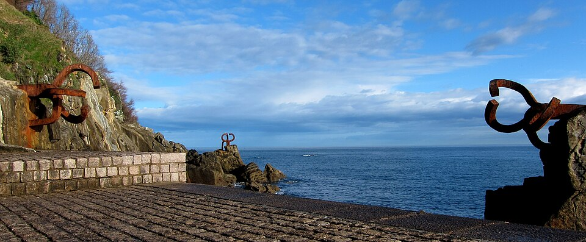

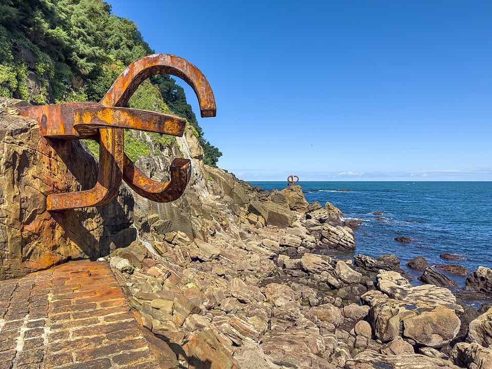

## 萨拉戈萨

### 当地特色活动

#### El Tubo 老城小吃巡游

在紧凑的小巷里选几家小吃店，每家试一两样，比抵达后赶更多大型景点轻松。这里的热闹晚餐氛围，是萨拉戈萨作为一晚中途停留地的好理由。

- 类型：当地饮食；按营业与预约安排
- 预留：建议 1.5–2 小时
- 日期与预约：自由散步与点单；具体店铺按当日营业情况选择。
- 地点：El Tubo 老城街区
- 顺路安排：巴塞罗那驾车抵达后，先看皮拉尔广场与河景，晚餐到 El Tubo；翌日再决定是否参观宫殿。
- [官方资料／预约](https://www.spain.info/es/lugares-interes/barrio-el-tubo/)

#### 埃布罗河城市皮划艇 · 本次新增

在教练带领下沿河认识城市桥梁、河岸生态与萨拉戈萨的水上视角。属于需要参与划行的活动，与坐观光船不同。

- 类型：户外与自然；预约且看水况
- 预留：约半天，按当期产品
- 日期与预约：官网列有城市航段与近郊航段；夏季黄昏场不能直接套用到四月。查实际开放日、集合点、年龄与水况取消规则。
- 地点：集合点随航段安排；地图定位为运营方搜索参考。
- 顺路安排：单独留半天；当天只中转数小时的话不宜硬塞。
- [官方资料／预约](https://ebronautas.net/ebrozgz-enamorate-de-la-capital-del-ebro/)

### 本次补充的文化与风景

#### 凯撒奥古斯塔罗马剧场博物馆

现代城市街区中保存的罗马剧场遗址，可与展厅一起理解古代演出、建筑结构和萨拉戈萨的罗马起源。它是皮拉尔大教堂之外的另一条城市历史线。

- 看点：剧场遗址与解释展示；可选同属罗马路线的论坛、浴场和河港博物馆。
- 预留：1–1.5 小时
- 参观提示：四馆联票与单馆票不同；一段中转停留不必把四馆全部排满。
- 顺路安排：与老城、El Tubo 小吃区顺路。
- [官方介绍](https://www.zaragoza.es/sede/portal/museos/teatro/)

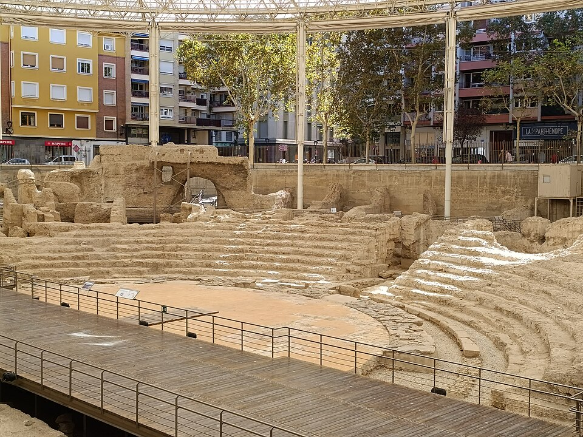

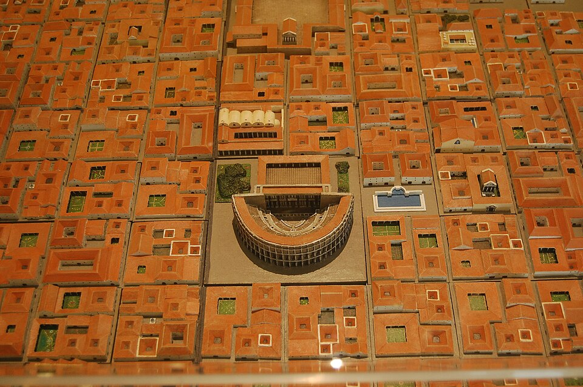

## 赫罗纳

### 当地特色活动

#### 绿道短程骑行 · 本次新增

利用旧铁路改造的绿道从城市边缘进入周边田野，补充赫罗纳老城之外的风景。选择适合往返距离的一小段，不必完成整条长线路。

- 类型：户外与自然；自主体验／可约骑行服务
- 预留：约 2–4 小时
- 日期与预约：租车、路线坡度和还车点需先确认；官网整条路线里程不能当作短程用时。雨后路况另查。
- 地点：按所选绿道起点和租车点集合；地图为城市绿道参考。
- 顺路安排：适合赫罗纳过夜或多半天时安排。
- [官方资料／预约](https://girona.cat/turisme/eng/ruta_viesverdes.php)

#### 尝赫罗纳 Xuixo 奶油甜点 · 本次新增

以酥脆外皮、糖粒和奶油馅见长的地方甜点，可作为认识赫罗纳饮食传统的小停靠。不是为旅行者臆造的制作课程。

- 类型：当地饮食；自主体验
- 预留：约 20–40 分钟
- 日期与预约：选择当天营业的糕点店；具体口味与是否现做按店铺确认。
- 地点：老城与市区糕点店，自选店铺。
- 顺路安排：老城或电影博物馆前后安排咖啡休息。
- [官方资料／预约](https://girona.cat/turisme/eng/gastronomia.php)

### 本次补充的文化与风景

#### 赫罗纳电影博物馆

从影戏、光学玩具和早期影像装置走到电影诞生，展示人们如何让静止图像动起来。它补充了赫罗纳中世纪街巷之外的影像艺术与技术文化。

- 看点：电影诞生前的光学装置、早期放映技术及 Tomàs Mallol 收藏。
- 预留：1–1.5 小时
- 参观提示：常设展示和临时展分开查看；开放语言与可体验装置以馆方安排为准。
- 顺路安排：可作为老城散步后的室内项目。
- [官方介绍](https://museudelcinema.girona.cat/eng/)

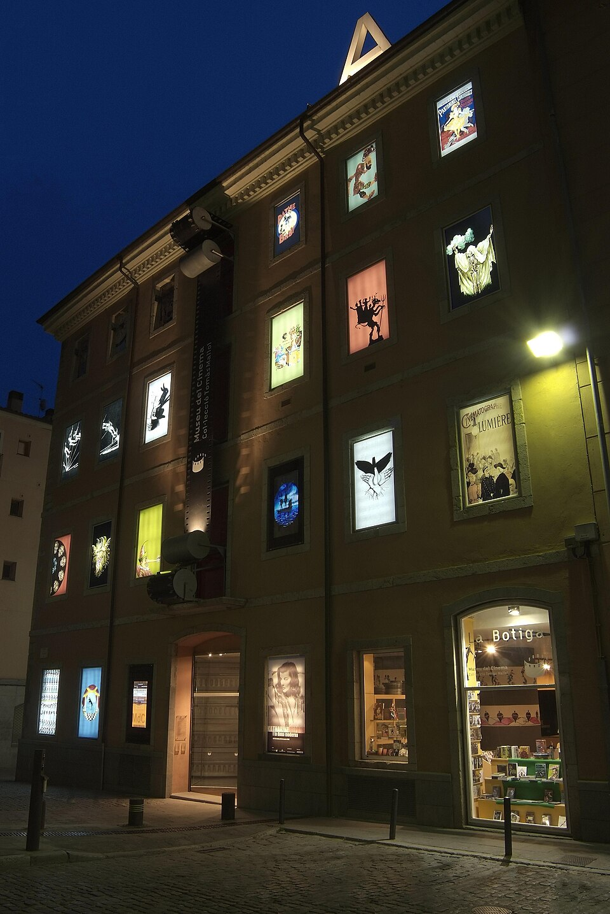

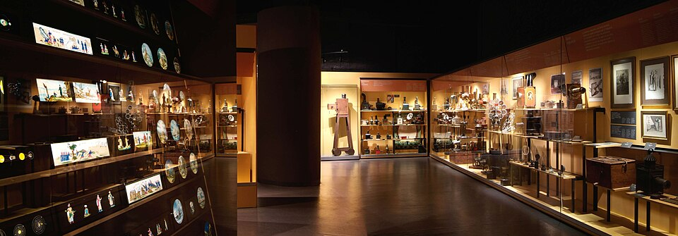

## 阿利坎特

### 当地特色活动

#### 中央市场采购日常与米饭料理

看海鲜、蔬果与本地食材摊位，再挑一餐阿利坎特米饭料理。比只把这座城市当成拆分长途的睡觉站，更容易记住它的地中海饮食特色。

- 类型：当地饮食；按营业与预约安排
- 预留：建议 1.5–2 小时，含市场与周边用餐
- 日期与预约：市场和餐馆各自营业；次日要长途去格拉纳达，不把午餐预约排得太晚。
- 地点：Mercado Central de Alicante
- 顺路安排：适合抵达当天尚在营业时顺访，或翌日早晨短逛；先核对具体日期营业时间。
- [官方资料／预约](https://alicanteturismo.com/en/gastronomy/)

#### 乘船去塔巴尔卡岛 · 本次新增

从港口出发到有人居住的小岛，在城墙街巷、海岸步道与餐馆之间慢行。这是带上岛停留的海岛行程，和不下船的港湾观光不同。

- 类型：游船与渡轮；看船期与海况
- 预留：半天至一天；阿利坎特单程约 1 小时
- 日期与预约：阿利坎特和 Santa Pola 的船程、港口不同；订好返航班次再安排午餐。四月不以海水游泳作为保证项目。
- 地点：从阿利坎特港或 Santa Pola 出发，以实际票为准。
- 顺路安排：包车司机可按选定港口接送；当天不再排满老城大景点。
- [官方资料／预约](https://alicanteturismo.com/en/tabarca-island/)

### 本次补充的文化与风景

#### 塔巴尔卡岛（乘船前往）

阿利坎特外海的有人居住小岛，兼有城墙街区、海岸地貌和海洋保护区背景。四月更适合步行看景与海鲜午餐，不必把下水作为主要目标。

- 看点：小岛街巷、城墙海岸及清澈海域的岸上观察。
- 预留：半天至一天，含船程
- 参观提示：核对实际出发港、返航班次和海况；岛上停留时间与船程不能混为一谈。保护区水上活动遵守运营方说明。
- 顺路安排：可从阿利坎特或 Santa Pola 出发，包车接送安排取决于所选港口。
- [官方介绍](https://alicanteturismo.com/en/tabarca-island/)

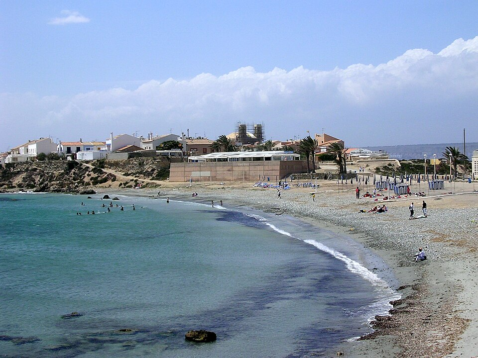

## 加的斯

### 当地特色活动

#### 坐海湾公共双体船去对岸 · 本次新增

使用连接加的斯、圣玛利亚港或罗塔的公共海运，从海面看港湾与城际生活。它是公共交通航班，没有保证的观光讲解或餐饮。

- 类型：游船与渡轮；看交通时刻表
- 预留：海上交通加对岸散步约半天
- 日期与预约：按交通联盟当天航线与返程时刻规划；海况可能影响运营，替代交通不一定是同一码头发船。
- 地点：加的斯海运码头；目的地选 El Puerto de Santa María 或 Rota。
- 顺路安排：选一个对岸城市即可，别把全部海湾城市放在一趟短行程。
- [官方资料／预约](https://cmtbc.es/)

#### 中央市场与海港小吃 · 本次新增

看海港城市的鱼类与海鲜摊位，再按食摊菜单尝炸鱼等当地食物。市场建筑、居民采购和餐饮区共同构成体验。

- 类型：当地饮食；自主体验
- 预留：约 1–1.5 小时
- 日期与预约：生鲜市场与餐饮区营业不完全相同；是否能代加工要逐店问，不能默认所有摊位提供。
- 地点：Plaza de la Libertad 一带。
- 顺路安排：老城上午散步或午餐时加入。
- [官方资料／预约](https://turismo.cadiz.es/es/zonas/mercado-central)

### 本次补充的文化与风景

#### 加的斯博物馆

通过腓尼基、罗马遗物和艺术收藏，理解加的斯作为古老海港的历史。它比单看大教堂和海岸更能说明城市为何与地中海航路长期相连。

- 看点：腓尼基人形石棺与古代海港相关器物；有余力再看绘画。
- 预留：1.5–2 小时
- 参观提示：馆藏介绍不代表每层或每厅均开放，出发前确认临时关闭和展览安排。
- 顺路安排：与米纳广场及老城散步组合。
- [官方介绍](https://www.museosdeandalucia.es/web/museodecadiz)

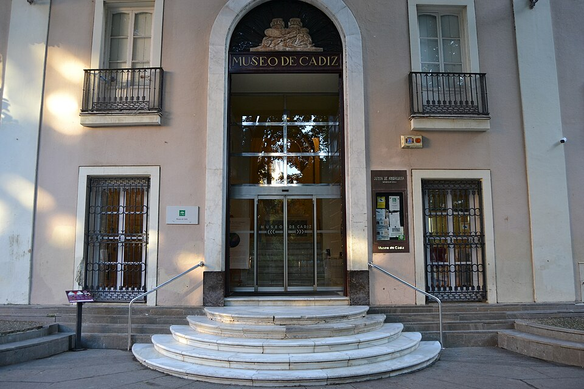

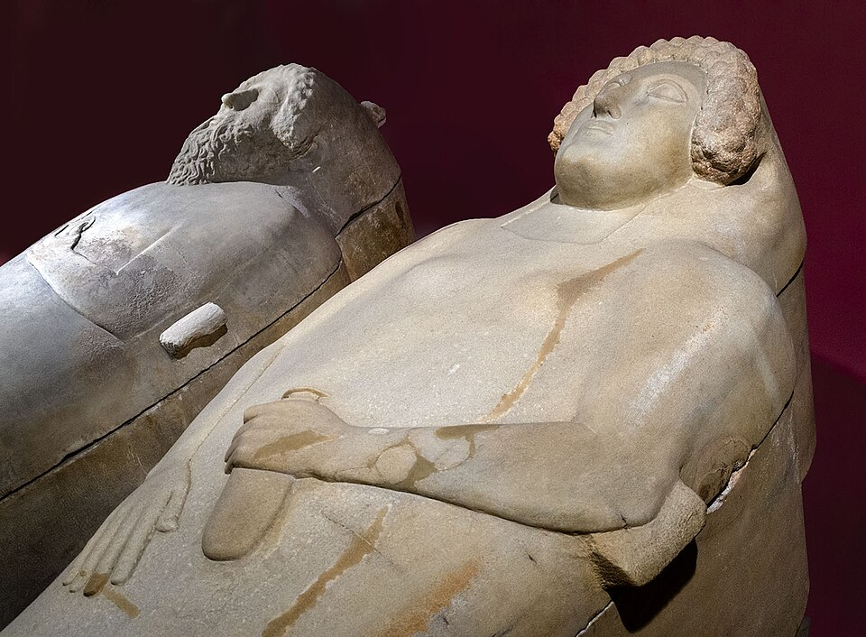

## 帕尔马

### 当地特色活动

#### 百年木制列车去索列尔 · 本次新增

从帕尔马乘历史列车穿过马略卡内陆与山地，到索列尔小镇；可另外衔接前往海港的电车，感受岛屿不同于帕尔马老城的一面。

- 类型：特色交通；按季节时刻表
- 预留：约半天至一天；单程列车约 1 小时
- 日期与预约：列车、港口电车与联票覆盖范围分别核对；2027 班次不能直接采用当前时刻表。
- 地点：帕尔马索列尔铁路站；港口电车属于后续衔接。
- 顺路安排：想继续去索列尔港或慢吃午餐时留整天。
- [官方资料／预约](https://trendesoller.com/horarios)

#### 传统咖啡馆尝 Ensaimada · 本次新增

螺旋形糕点是马略卡的代表性食物之一，搭配咖啡或热饮，可在老城走累时认识岛上的烘焙传统。

- 类型：当地饮食；自主体验
- 预留：约 30–60 分钟
- 日期与预约：不同店铺有原味和夹馅等版本，营业与供应按当天为准；这是自行到店品尝。
- 地点：帕尔马老城糕点店或传统咖啡馆，自选店铺。
- 顺路安排：帕尔马老城参观间隙安排即可。
- [官方资料／预约](https://visitpalma.com/en/dir/ensaimadas-light-airy-and-delicate-pastry/)

### 本次补充的文化与风景

#### Es Baluard 当代艺术博物馆

博物馆把当代艺术放进帕尔马历史防御空间中，既能看展，也能观察城墙、海港与城市的关系。其艺术讨论与地中海环境有密切联系。

- 看点：当期现代与当代艺术展、堡垒建筑与室外视角。
- 预留：1.5–2 小时
- 参观提示：馆藏会轮换；展厅票、公共空间和特殊活动开放要求分别确认。
- 顺路安排：与老城西侧和 Santa Catalina 方向散步组合。
- [官方介绍](https://esbaluard.org/en/collection/)

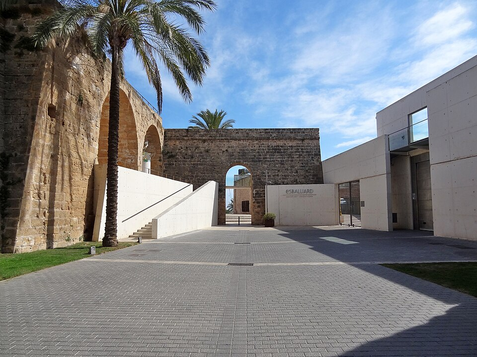

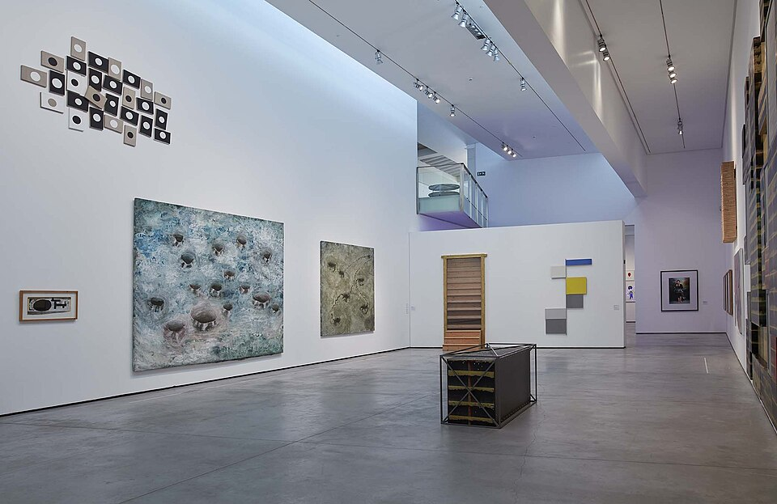

## 圣克鲁斯

### 当地特色活动

#### 特内里费岛西南海域观鲸豚 · 本次新增

从岛西南部港口出海观察海洋哺乳动物，是特内里费有代表性的海上活动。观察对象是野生动物，不能保证每航次的物种和出现距离。

- 类型：游船与渡轮；看海况、选择授权运营商
- 预留：船程常见约 2–3 小时；从圣克鲁斯出发另留较长接送
- 日期与预约：旅游局列有规范与参与名单，按具体运营商确认航线。主要从 Puerto Colón 等西南港口出发，不是在圣克鲁斯老城码头上船。
- 地点：岛西南 Adeje／Puerto Colón 等港口，按所订船确认。
- 顺路安排：住圣克鲁斯时宜按一日出游计算，避免当天再串阿纳加山区。
- [官方资料／预约](https://www.webtenerife.com/que-hacer/naturaleza/avistamiento-cetaceos/carta-sostenibilidad/)

#### 泰德火山日落与星空活动 · 本次新增

离开城市灯光，在火山高地观察夜空，并通过导览认识星座与天文环境。日落、缆车、晚餐和望远镜观测是否包含，取决于票种。

- 类型：户外与自然；看云量、风况与日期
- 预留：傍晚至夜间，约半天
- 日期与预约：高海拔夜间寒冷，按运营商说明准备衣物并核对参加条件；缆车运行和能见度并非保证。
- 地点：泰德国家公园，具体观测点按所订活动。
- 顺路安排：留意从圣克鲁斯的接送范围和回城时间，不接紧迫的夜间航班。
- [官方资料／预约](https://www.volcanoteide.com/en/volcano_teide/stars/sunset_and_stars_on_teide)

### 本次补充的文化与风景

#### 阿纳加乡村公园（岛内山地）

特内里费东北部的山脉、古老月桂林和山村景观，与泰德火山和海滩形成明显对照。可先从游客中心及短步道认识云雾林，再按体力选择更长路线。

- 看点：Cruz del Carmen 周边林地、月桂林与山脊观景。
- 预留：半天至一天
- 参观提示：山地天气变化快；部分保护区步道实行预约或通行限制。先查 Tenerife ON，不能把地图上的所有小径都视作随到随走。
- 顺路安排：从圣克鲁斯包车前往，避免同一天再绕去岛南部参加长时间活动。
- [官方介绍](https://www.webtenerife.co.uk/what-see/outdoor-attractions/parque-rural-de-anaga/)

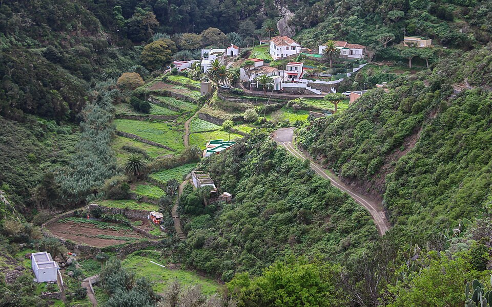

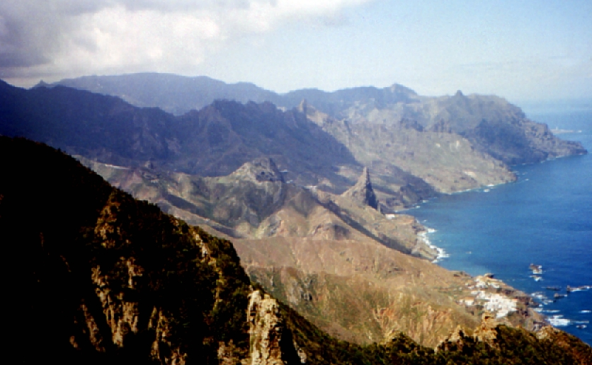

## 梅里达

### 当地特色活动

#### 从渡槽到罗马桥，读古城的用水与交通 · 本次新增

把奇迹渡槽、城市街巷与瓜迪亚纳河上的罗马桥串成一段自主步行，从工程和地形理解罗马城市，而不只围着剧场看古迹。

- 类型：城市漫步；自主体验
- 预留：约 1.5–2.5 小时，按绕行与休息调整
- 日期与预约：这是按公开遗址组织的步行建议，没有声称存在统一售卖的导览产品；需入馆或进入收费遗址时另购票。
- 地点：奇迹渡槽至罗马桥，路线依住宿和当日天气调整。
- 顺路安排：可拆为到达日下午的渡槽和次日离开前的河岸。
- [官方资料／预约](https://turismomerida.org/que-ver/acueducto-de-los-milagros/)

#### 罗马剧场里的古典戏剧节 · 本次新增

夏季在古罗马剧场观看戏剧，把遗址从白天的参观空间变为夜间舞台。实际剧目、语言和演出形式每届不同。

- 类型：现场演出；主要夏季｜清明不排
- 预留：一个晚间，按剧目
- 日期与预约：已核对的 2026 届属于夏季活动；2027 日历仍需确认。四月清明行程只能安排遗址参观，不能把夏季戏剧节列成当晚可看。
- 地点：罗马剧场；以所选剧目场地为准。
- 顺路安排：仅当旅行改到夏季时考虑，演出当晚宜住梅里达。
- [官方资料／预约](https://www.festivaldemerida.es/archivo/edicion-72-2026/)

### 本次补充的文化与风景

#### 奇迹渡槽

高大的罗马输水结构把工程遗产直接放在城市绿地中。砖石相间的拱券和残存桥墩帮助理解古代梅里达如何获得生活用水，参观节奏比剧场区更轻。

- 看点：拱券层次、砖石结构与绿地中的远近视角。
- 预留：30–60 分钟
- 参观提示：属于露天遗址，天气和光线影响观赏；不攀爬遗迹。
- 顺路安排：可在到达或离开梅里达时另留短停。
- [官方介绍](https://turismomerida.org/que-ver/acueducto-de-los-milagros/)

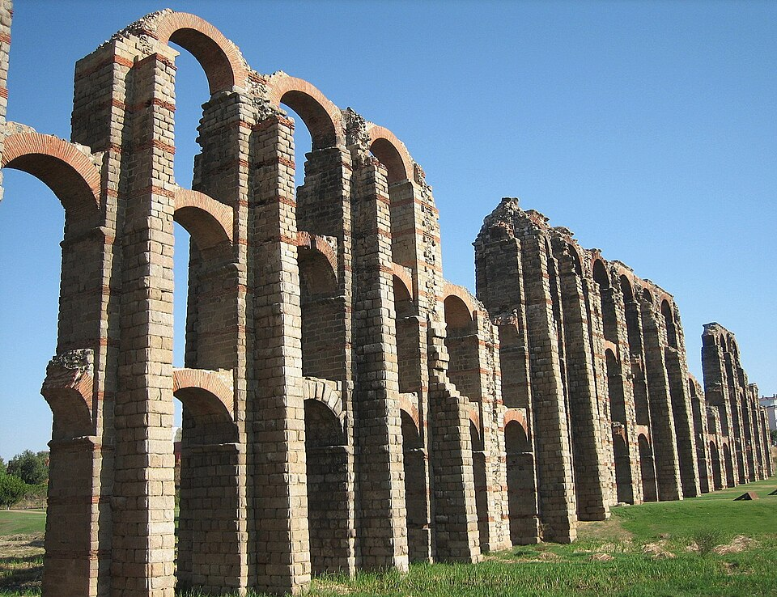

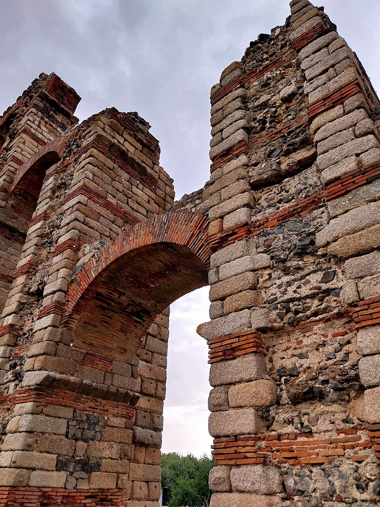

## 里斯本

### 当地特色活动

#### 里斯本 Fado 现场演唱 · 本次新增

通过葡萄牙吉他、歌声和小型现场空间认识里斯本的 Fado 传统。可选单独演出，也可选择含晚餐的场所，两者时长与预算不同。

- 类型：现场演出；按场次预约
- 预留：纯演出约 1 小时；晚餐场另计
- 日期与预约：此处官方链接为 Chiado 演出介绍；若选 Alfama 餐厅场需另查票价、最低消费和演出开始时间。
- 地点：Chiado 或所选 Fado 场所，不能把所有场次定位在同一家。
- 顺路安排：白天游览后安排，晚餐和演出是否合并由所选票种决定。
- [官方资料／预约](https://www.visitlisboa.com/en/places/fado-in-chiado)

#### 特茹河游船看里斯本河岸 · 本次新增

从宽阔河面看里斯本山坡、桥梁与贝伦方向的河岸建筑。短巡游、随上随下和日落航次各有不同停靠与时长。

- 类型：游船与渡轮；按船期预约
- 预留：约 1–2 小时，按产品
- 日期与预约：先选具体航线，再确认上下船码头、停靠和末班；日落时间与航班会随季节改变。
- 地点：常见码头在商业广场河岸等处，以所购产品为准。
- 顺路安排：可与贝伦或商业广场周边组合，交通方式按实际停靠选择。
- [官方资料／预约](https://yellowbustours.com/en/lisbon/products)

### 本次补充的文化与风景

#### MAAT 艺术、建筑与科技博物馆

特茹河边的当代文化机构把艺术、建筑、科技与旧发电站的工业历史相连。适合从河岸公共空间进入，再按当期主题选择展览，不局限于古典藏品。

- 看点：河岸建筑与公共空间、当期艺术展，以及旧发电站相关展示。
- 预留：1.5–2.5 小时
- 参观提示：新馆、旧电厂及特别展的开放与票种分别核对；河岸散步和入馆参观是不同安排。
- 顺路安排：与贝伦区组合，但不要与修道院、阿茹达宫全塞进同一半天。
- [官方介绍](https://www.maat.pt/en)

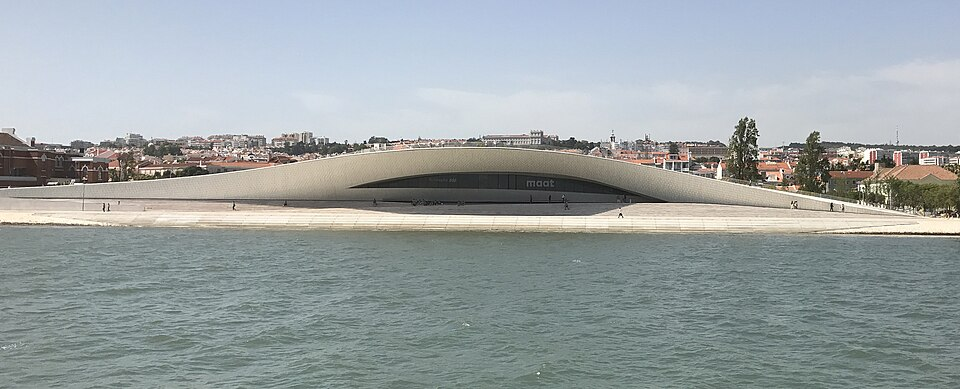

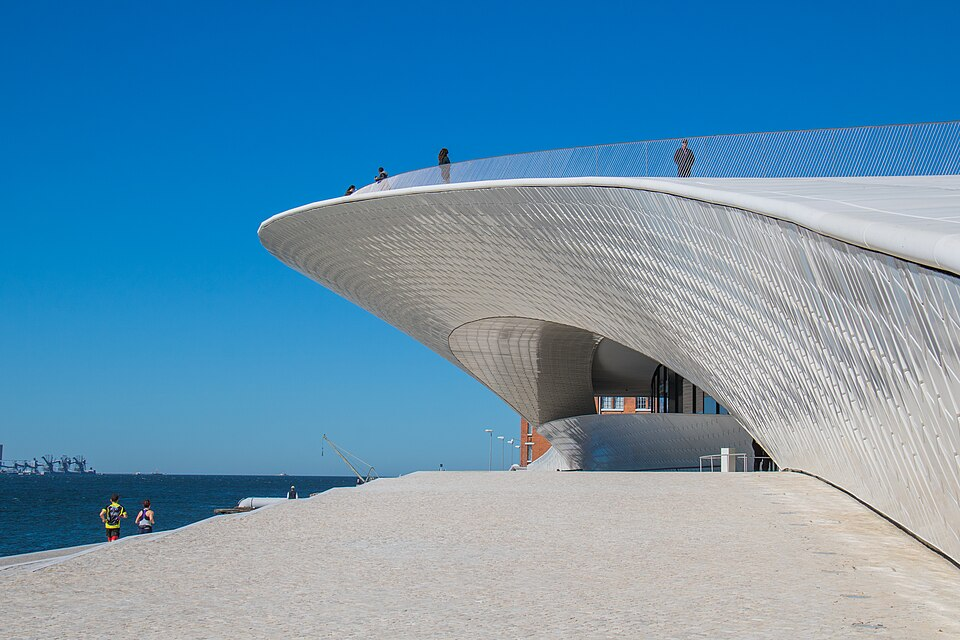

## 波尔图

### 当地特色活动

#### 杜罗河六桥短程游船 · 本次新增

沿波尔图与加亚之间的河道看桥梁、陡岸建筑与酒窖区，适合在岸上散步之外补充水面视角。它是市区短游，不是深入杜罗河谷的一日航程。

- 类型：游船与渡轮；看船期与水况
- 预留：船程约 50 分钟，另留候船
- 日期与预约：核对从 Ribeira 还是 Gaia 岸上船；常规票是否含讲解、酒窖或品酒因产品不同。
- 地点：波尔图 Ribeira／加亚码头，按船票确认。
- 顺路安排：Ribeira 和路易一世大桥附近游览前后安排。
- [官方资料／预约](https://www.douroacima.pt/pt/cruzeiro-no-douro-pt/)

#### 加亚波特酒窖导览与品尝 · 本次新增

过河到 Vila Nova de Gaia，了解波特酒的生产、熟成与贸易历史，再按票种参加品尝。参观重点是酒窖和工艺，与市区零售店试饮不同。

- 类型：地方传统；预约场次与语言
- 预留：约 1.5–2 小时
- 日期与预约：示例采用 Taylor’s 官方参观，页面列有多语言语音导览；品尝内容和中文选项需按预订确认，其他酒窖另查。
- 地点：Rua do Choupelo，加亚一侧。
- 顺路安排：可与加亚河岸或六桥游船组成半天，注意上坡步行。
- [官方资料／预约](https://www.taylor.pt/en/visit-taylors/port-cellars)

### 本次补充的文化与风景

#### 波尔图音乐之家

雷姆·库哈斯设计的音乐厅既是演出场所，也是波尔图当代建筑的重要一站。建筑导览与听音乐会是两种参观方式，可根据当期节目和导览场次分别选择。

- 看点：混凝土外形、室内声学与空间设计；官方导览介绍建筑和音乐功能。
- 预留：导览约 1 小时；演出另按节目时长
- 参观提示：排练和演出可能限制部分厅室进入，官网明确需确认当天可参观空间。
- 顺路安排：位于 Boavista，可与塞拉维斯方向安排同一天，留出交通时间。
- [官方介绍](https://casadamusica.com/en/a-casa/guided-tours/)

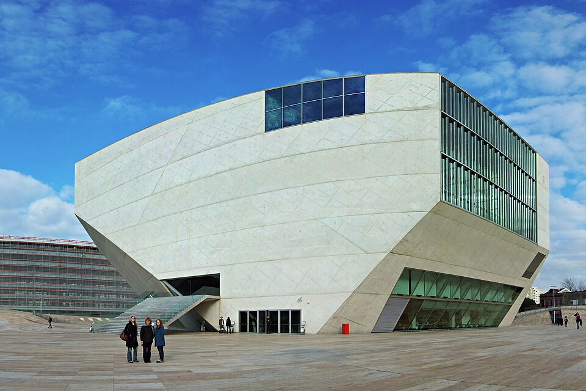

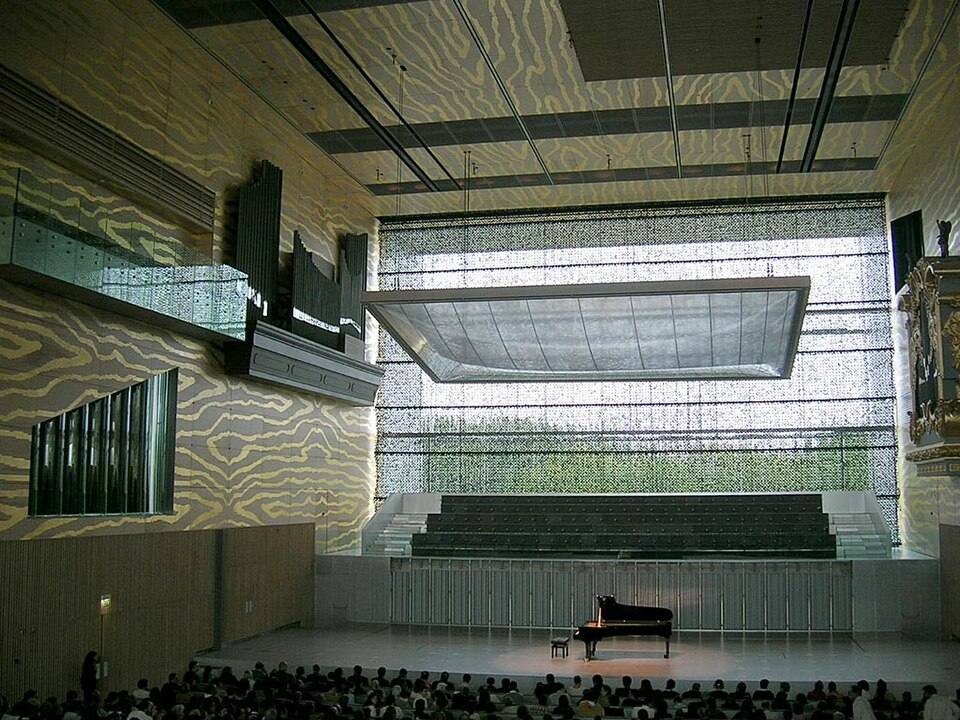